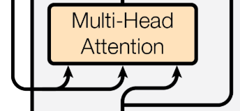

# Encoder-Decoder(T5 Model):  
- input: text  
- output:  
next word (token), 附帶在 Decoder input 內  
- 特性:  
cross-attention  
(information from the encoder into the decoder)  
- 用途: 翻譯  

以 T5 Model 為例:  

  

## cross-attention  
[cross-attention Paper](<https://arxiv.org/abs/2104.08771> "論文出處")   
使用於 Encoder-Decoder, 對 machine translation 極為重要(與 self-attention 相比)  

### 與 self-attention 的差異:  
1.cross-attention 要注意 pruning 的使用(cross-attention 對 pruning 非常的敏感,過度使用會導致品質下降)  
2. 無法使用對應方法替代(hard-coded),不會影響性能  
(替代方法舉例: input-independent Gaussian distribution)  

### pruning:  
定義:  
一種模型壓縮的方式，有效地精簡模型參數並最小化損失。  

應用:  
1.多層感知機(MLP)  
2.卷積神經網路(CNN)   
3.機器翻譯(MT)  
- 運用在 machine translation 的效果  
    -  transfer learning(遷移學習):  
        分別訓練(parent model and child model)  
        - parent model(high-resource language pair)  
            ```
            用於資料較多(parallel data)的語言
            ```  
        - child model(low-resource language pair)  
            ```
            用於新的語言或是資料較少(parallel data)的語言
            ```  
- 結果  
    - 減少災難性遺忘(catastrophic forgetting)的可能性
    - 開發出不需要樣本即可翻譯的潛能
    - 可翻譯多種語言，並減少儲存參數的消耗  

```
何謂災難性遺忘(catastrophic forgetting):  
當模型接受到新資訊來訓練時，已掌握資料的訓練品質會因此下降(會遺忘先前某些部分的記憶)。  

影響:  
1.訓練資源的訓練效率較低  
2.抑制模型自我學習的行為  
3.會讓大型模型無法正常訓練  

改善方式:  
1.建立資料暫存區,讓模型不會因為遺忘先前的資料而導致效率低  
2.在(loss function)中加入懲罰項，限制訓練過程中的權重更變(利於保留先前知識)  
3.使外部記憶組件的模型能選擇保留先前任務中的重要資訊  
4.動態調整權重，讓模型能適應新的訓練資料(防止遺忘)
```

### transfer learning(遷移學習)  
  
- a. 從頭完整訓練模型  
- b. 標準方式微調(fine-tuning)模型(src+body)  
- c. 使用(cross-attention)微調模型(src+xattn)  
- d. fine-tuning new vocabulary (src)
- e. 進行語言翻譯時，微調 cross-attention（tgt+xattn）  
- f. 從頭更新 (cross-attention) 的遷移學習(transfer learning)  
    ```
    虛線: 隨機初始化。  
    實線: 初始化(預訓練模型參數)。  
    陰影部分(or)下底線部分: 進行微調。  
    剩餘部分不看。  
    ```
### 定義  
- parent model 的訓練集($f_{\theta}$):  
    格式: ($x_{s_{p}}$, $y_{t_{p}}$)  
        - $s_{p}$: source sentences   
        - $t_{p}$: target sentences  
- fine-tuning: 從 $f_{\theta}$ 取得 parameters $\theta$, 來初始化 model $g_{\theta}$  

- $g_{\theta}$:  
    利用 child model 進行優化(收斂至 $g_{\phi}$)

- child model 的訓練集:  
    格式: ($x_{s_{c}}$, $y_{t_{c}}$)  
        - $s_{c}$: source sentences   
        - $t_{c}$: target sentences   
    假設:  
    $s_{c}$ = $s_{p}$  
    $t_{c}$ = $t_{p}$  

- $\theta$:  
    $\theta = \bigcup \lbrace \theta _{src},\theta _{tgt},\theta _{enc},\theta _{dec},\theta _{xattn} \rbrace$  
    - $\theta _{src}$(來源):  
    includes  
    source-language token embeddings,  
    source positional embeddings,  
    source embeddings layer norm parameters  

    - $\theta _{tgt}$(目標):  
    includes  
    target-language (tied) input and output token embeddings,  
    target positional embeddings,  
    target embeddings layer norm parameters  

    - $\theta _{enc}$(encoder):  
    includes  
    self-attention,  
    layer norm,  
    feed-forward parameters  

    - $\theta _{dec}$(decoder):  
    includes  
    selfattention,  
    layer norm,  
    feed-forward parameters  

    - $\theta _{xattn}$(cross attention):  
    includes  
    crossattention  
    corresponding layer norm parameters  　
### 實作
#### 環境配置  
```
Ubuntu 22.04.4 LTS  
conda 24.5.0
Python 3.10.14
Pytorch 2.3.1  
```  
#### 流程圖  
  
  

#### 參數解釋(個人看法)  
- x1(中文), x2(英文):  
    視為輸入，在這個範例中以輸入文字序列為主(也可運用在不同情況的輸入上);分為中文及英文輸入，因為我想觀察英文和中文經過 embedding 的差異性及 cross-attention 處理不同語言時的輸出。      
- dim_input, dim_KorQ, dim_V:  
    - dim_input:  
    輸入文字序列後，經由 embedding 轉換為 Trnsor([...])  
    - dim_KorQ:  
    Cross-Attention 中(dim_K=dim_Q)，所以將2者寫再一起，可調整參數，調整(Key, Query, input)維度  
    - dim_V:  
    此參數為 (Value) 的維度設定  
- $W_{q}$, $W_{k}$, $W_{v}$ :  
    - $W_{q}$ :  
    由 input, dim_Q 所組成的矩陣,為 query 的權重  
    大小為 (dum_imput * dim_Q) 的矩陣

    - $W_{k}$ :  
    由 input, dim_K 所組成的矩陣,為 key 的權重  
    大小為 (dum_imput * dim_K) 的矩陣

    - $W_{v}$ :  
    由 input, dim_V 所組成的矩陣,為 value 的權重  
    大小為 (dum_imput * dim_V) 的矩陣  

- Q, K, V (上圖紫色區塊):  
    - Q :  
    要查詢的信息，以矩陣的形式儲存  
    公式: Q = $(dim_{input} W_{q})_{ij}$ (矩陣相乘)  

    - K :  
    鍵的矩陣(可理解為查詢所得到的索引值)  
    公式: K = $(dim_{input} W_{k})_{ij}$ (矩陣相乘)  

    - V :  
    值的矩陣(可理解為查詢所得到的內容)  
    公式: V = $(dim_{input} W_{v})_{ij}$ (矩陣相乘)  
- Cross-Attention 與 self-Attention 公式的差異:  
    以公式上來看，兩者相差了 $1 / \sqrt{d_{k}}$ ，  
    從架構上來說 ， Cross-Attention 會缺少 $1 / \sqrt{d_{k}}$ ，  
    是因為:  
    Cross-Attention 是雙序列輸入；  
    Self-Attention 是單序列輸入。  
    

#### 程式碼  
[Cross-attention](cross-attention.py)  

#### 程式碼解析  
- 輸入  
```
第一句(中文): 當我走在這條熟悉的街道上，每一個角落都帶給我懷舊和溫馨的回憶。這裡的風景如此熟悉，彷彿時間在這裡停滯。每一個店鋪的櫥窗都展示著不同的故事，每一個笑臉路人都在述說著生活的奇妙。這裡的每一處都是我曾經生活過的一部分，每一個瞬間都值得被珍惜。  

第二句(英文): Under the starlit sky, the campfire crackled softly as laughter echoed through the night.
```
- Cross-attention 實現(依照上圖)  
```python
class Cross_Attention(nn.Module):
    def __init__(self, dim_input, dim_KorQ, dim_V):
        super().__init__()
        self.dim_KorQ=dim_KorQ
        self.Weight_Q=nn.Parameter(torch.rand(dim_input, dim_KorQ))
        self.Weight_K=nn.Parameter(torch.rand(dim_input, dim_KorQ))
        self.Weight_V=nn.Parameter(torch.rand(dim_input, dim_V))
    
    def forward(self,input_1,input_2):
        input1_Q=input_1.matmul(self.Weight_Q)
        input2_K=input_2.matmul(self.Weight_K)
        input2_V=input_2.matmul(self.Weight_V)
        
        #根號運算
        #sqrt_k = math.sqrt(self.dim_KorQ)

        #Cross-Attention(Q,K,V)
        A=torch.softmax(input1_Q.matmul(input2_K.T), dim=-1)
        
        Cross-Attention=A.matmul(input2_V)
        return Cross-Attention
```  
$$Cross-Attention(Q,K,V)=softmax(QK^{T})V$$  

- Embedding  
```python
# 前處理輸入 (ids and token)
def Embedding_input(sentence:str, temp_str:str):
    for i in punctuation: 
        inputs = sentence.replace(i,'')

    for line in inputs: 
        temp_str+=line 

    for i,s in enumerate(str(temp_str)):
        sorts = {s:i}
        ids.update(sorts)

    for s in temp_str:  
        tokens.append(ids[s])
    

    input_tokens=torch.tensor(tokens)
    #100 tensors of size 80
    embedding=torch.nn.Embedding(1000, 1000)
    #產生embedding vector, detach() 防止反向傳播(Backpropagation)
    embedded_sentence=embedding(input_tokens).detach()
    return embedded_sentence

# 前處理輸入2 (ids and token)
def Embedding_input2(sentence:str, temp_str:str, dim_input:int):
    for i in punctuation: 
        inputs = sentence.replace(i,'')

    for line in inputs: 
        temp_str+=line 

    for i,s in enumerate(str(temp_str)):
        sorts = {s:i}
        ids.update(sorts)

    for s in temp_str:  
        tokens.append(ids[s])
    

    input_tokens=torch.tensor(tokens)
    #100 tensors of size 80
    embedding2=torch.nn.Embedding(700, dim_input)
    #產生embedding vector, detach() 防止反向傳播(Backpropagation)
    embedded_sentence=embedding2(input_tokens).detach()
    return embedded_sentence


#embedding
input1 = Embedding_input(sentence=input_sentence_1, temp_str=temp_str)
input2 = Embedding_input2(sentence=input_sentence_2, temp_str=temp_str, dim_input=input1.shape[1])

```  
- Embedding 呈現結果
```bash
第一句: tensor([[-0.5198,  0.3470,  0.9542,  ..., -0.2906, -0.7541, -0.1910],
        [ 0.4580, -0.2397, -2.1618,  ...,  0.4043, -0.7210,  1.9984],
        [ 0.7037,  0.0859, -0.7663,  ..., -0.1699,  0.9142,  0.9919],
        ...,
        [-0.1717, -0.3151, -0.6345,  ..., -0.3655, -0.7029, -0.2115],
        [ 0.1933,  2.4776,  0.1326,  ...,  0.0211,  1.3048, -0.0508],
        [ 0.7264,  1.4849, -1.5912,  ..., -1.6529, -0.3693,  0.5136]])
第一句話的大小: torch.Size([118, 1000]) 
#依照 embedding=torch.nn.Embedding() 的設定

第二句: tensor([[ 0.4122,  1.3622,  1.4179,  ..., -0.2374, -0.4725, -0.0678],
        [ 0.2543, -1.5880, -2.0067,  ...,  0.6412,  1.0444, -0.2635],
        [-0.0516, -2.3055, -1.2522,  ..., -0.1767, -0.2494,  2.6028],
        ...,
        [-1.8518, -1.1677, -0.7446,  ..., -1.4019, -3.6248, -0.4174],
        [-2.6846, -0.3624,  0.5680,  ..., -0.0322, -0.9826, -0.0833],
        [-0.1356, -0.4895, -0.7929,  ...,  1.3854, -0.4265, -0.2980]])
第二句話的大小: torch.Size([207, 1000])
#依照 embedding=torch.nn.Embedding() 的設定
```

- 補充 torch.softmax()  
$$Softmax(x_{i})=\frac{exp(x_{i})}{\sum_{j}^{}x_{j}}$$
```python
#輸入固定,比較差異
import torch
m_0 = nn.Softmax(dim=0)
m_burden1 = nn.Softmax(dim=-1)
m_1 = nn.Softmax(dim=1)
m_2 = nn.Softmax(dim=2)
inputs = torch.tensor(
          [[[ 1.2443,  1.1013, -0.4254]
          ,[-0.1339, -1.5593,  0.9886]],
           
          [[ 1.2443,  1.1013, -0.4254],
           [-0.1339, -1.5593,  0.9886]]])
print(m_0(inputs))
print(m_burden1(inputs))
print(m_1(inputs))
print(m_2(inputs))
"""
m_0(inputs): 維度為0的元素相加等於1
tensor([[[0.5000, 0.5000, 0.5000],
         [0.5000, 0.5000, 0.5000]],

        [[0.5000, 0.5000, 0.5000],
         [0.5000, 0.5000, 0.5000]]])
規律: (0,0,0)+(1,0,0)=1, (0,0,1)+(1,0,1)=1, (0,0,2)+(1,0,2)=1, (0,1,0)+(1,1,0), 以此類推...

m_burden1(inputs)
tensor([[[0.4866, 0.4218, 0.0916],
         [0.2319, 0.0557, 0.7124]],

        [[0.4866, 0.4218, 0.0916],
         [0.2319, 0.0557, 0.7124]]])
規律(與 dim=2 相同):  (0,0,0)+(0,0,1)+(0,0,2)=1, (0,1,0)+(0,1,1)+(0,1,2)=1, 以此類推...

m_1(inputs): 維度為1的元素相加等於1
tensor([[[0.7987, 0.9347, 0.1956],
         [0.2013, 0.0653, 0.8044]],

        [[0.7987, 0.9347, 0.1956],
         [0.2013, 0.0653, 0.8044]]])
規律: (0,0,0)+(0,1,0)=1, (0,0,1)+(0,1,1)=1, (0,0,2)+(0,1,2)=1, 以此類推...

m_2(inputs): 維度為2的元素相加等於1
tensor([[[0.4866, 0.4218, 0.0916],
         [0.2319, 0.0557, 0.7124]],

        [[0.4866, 0.4218, 0.0916],
         [0.2319, 0.0557, 0.7124]]])
"""
```
#### 完整程式碼
```python
import torch.nn as nn
import torch
import math

punctuation="，。、[],.!"
temp_str = str() 
ids = {}
tokens = []

input_sentence_1 = input("輸入中文句子: ")
input_sentence_2 = input("輸入英文句子: ")

# 定義 cross-attention
"""
參數定義:
query: (input*dim_keyorquery)(因為 key = query) of vector
key: (input*dim_keyorquery)(因為 key = query) of vector
value: (input*dim_value) of vector
"""
class Cross_Attention(nn.Module):
    def __init__(self, dim_input, dim_KorQ, dim_V):
        super().__init__()
        self.dim_KorQ=dim_KorQ
        self.Weight_Q=nn.Parameter(torch.rand(dim_input, dim_KorQ))
        self.Weight_K=nn.Parameter(torch.rand(dim_input, dim_KorQ))
        self.Weight_V=nn.Parameter(torch.rand(dim_input, dim_V))
    
    def forward(self,input_1,input_2):
        input1_Q=input_1.matmul(self.Weight_Q)
        input2_K=input_2.matmul(self.Weight_K)
        input2_V=input_2.matmul(self.Weight_V)
        
        #根號運算
        sqrt_k = math.sqrt(self.dim_KorQ)

        #Attention(Q,K,V)
        W=torch.softmax(input1_Q.matmul(input2_K.T)/sqrt_k, dim=-1)
        
        Attention=W.matmul(input2_V)
        return Attention

# 前處理輸入 (ids and token)
def Embedding_input(sentence:str, temp_str:str):
    for i in punctuation: 
        inputs = sentence.replace(i,'')

    for line in inputs: 
        temp_str+=line 

    for i,s in enumerate(str(temp_str)):
        sorts = {s:i}
        ids.update(sorts)

    for s in temp_str:  
        tokens.append(ids[s])
    

    input_tokens=torch.tensor(tokens)
    #100 tensors of size 80
    embedding=torch.nn.Embedding(100, 100)
    #產生embedding vector, detach() 防止反向傳播(Backpropagation)
    embedded_sentence=embedding(input_tokens).detach()
    return embedded_sentence

# 前處理輸入2 (ids and token)
def Embedding_input2(sentence:str, temp_str:str, dim_input:int):
    for i in punctuation: 
        inputs = sentence.replace(i,'')

    for line in inputs: 
        temp_str+=line 

    for i,s in enumerate(str(temp_str)):
        sorts = {s:i}
        ids.update(sorts)

    for s in temp_str:  
        tokens.append(ids[s])
    

    input_tokens=torch.tensor(tokens)
    #100 tensors of size 80
    embedding2=torch.nn.Embedding(70, dim_input)
    #產生embedding vector, detach() 防止反向傳播(Backpropagation)
    embedded_sentence=embedding2(input_tokens).detach()
    return embedded_sentence


#embedding
input1 = Embedding_input(sentence=input_sentence_1, temp_str=temp_str)
input2 = Embedding_input2(sentence=input_sentence_2, temp_str=temp_str, dim_input=input1.shape[1])

#參數
dim_input, dim_keyorquery, dim_value = input1.shape[1],32,48

#隨機種子,讓此文件由 rand() 輸出的資料都固定
#range: [-0x8000000000000000, 0xffffffffffffffff]
#[-9223372036854775808, 18446744073709551615]，超出該範圍將觸發RuntimeError報錯。
torch.manual_seed(123)

# CrossAttention
cross_attention=Cross_Attention(dim_input, dim_keyorquery, dim_value)

context_vectors=cross_attention(input1, input2)

print(context_vectors)
print(context_vectors.shape)
```
輸出:  
```bash
tensor([[ 54.6506,  45.3390,  58.2769,  ...,  45.6366,  44.4328,  42.9971],
        [ 54.6506,  45.3390,  58.2769,  ...,  45.6366,  44.4328,  42.9971],
        [-36.9217, -46.2097, -34.7395,  ..., -35.7058, -45.1091, -54.8270],
        ...,
        [ 54.6506,  45.3390,  58.2769,  ...,  45.6366,  44.4328,  42.9971],
        [-37.1539, -46.0859, -35.1189,  ..., -35.9307, -44.8170, -54.7477],
        [-36.8671, -46.2387, -34.6503,  ..., -35.6529, -45.1777, -54.8457]],
       grad_fn=<MmBackward0>)
torch.Size([118, 48])
```
