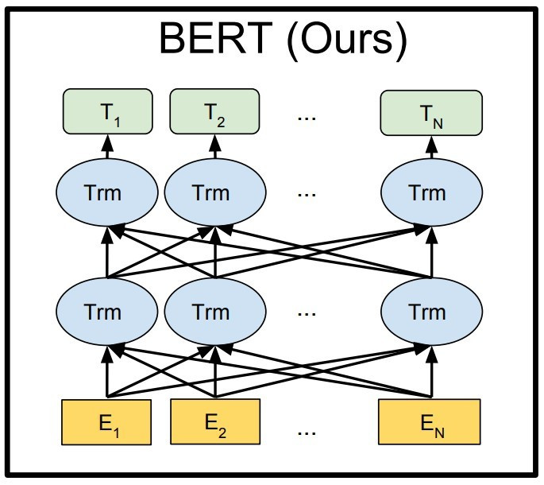
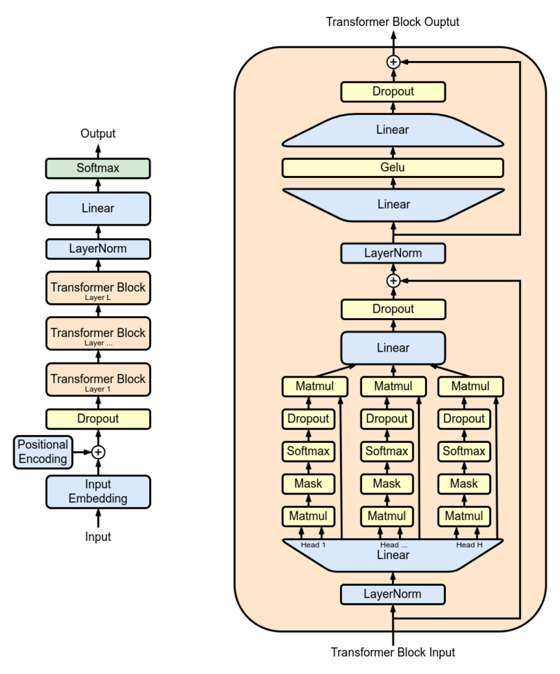

# Transformer  
## 簡介  
Transformer 可分為2個部分：  
- Encoder(==N(層數) = 6==)，每層內含(Two sublayers):  
    - Multi-head Attention:  
        ```
        流程:  
        輸入(偏移內容)  
        -> 此子層(output)  
        -> residual(殘差) connection+layer normalization  
        -> Fully Connected Feed-Forward Network(input)  
        ```  

    - Fully Connected Feed-Forward Network(全連接前饋式網路):  
        ```
        流程:  
        -> 輸入內容(前一子層輸出)  
        -> 此子層(Output)  
        -> residual(殘差) connection+layer normalization  
        -> output or (Input Decoder Multi-Head Attention Sub-layer)  
        ```  
    ``` 
    備註：  
    為了方便 residual(殘差) connection ， Encoder 內 (all sublayers and Embedding layers) 的輸出維度(dimension) 皆為 dmodel = 512  
    ```  
    子層的輸出(Output)：  
    $LayerNorm \left ( x + Sublayer\left ( x \right ) \right )$  
    
- Decoder(==N(層數) = 6==)，每層內含(Three sublayers):  
    比 Encoder 多加了一層(sublayer):  
    - Masked Multi-Head Attention:  
        ```
        作用: 防止注意力關注到後續的位置   
        改良方式(由 Multi-Head Attention):  
        將輸入內容進行遮罩(預測第X個位置時，只能參考 index(X) 之前索引的內容)  

        流程:    
        輸入(偏移內容)  
        -> 此子層(output)  
        -> residual(殘差) connection+layer normalization  
        -> Multi-head Attention(input)  
        ```
    
    - Multi-head Attention:  
        ```
        與 Encoder 不同，此子層會輸入(Encoder Output+Masked Multi-head Attention Output)  

        流程:  
        輸入(Encoder Output + 前一子層輸出)  
        -> 此子層(output)  
        -> residual(殘差) connection+layer normalization  
        -> Fully Connected Feed-Forward Network(input)  
        ```  

    - Fully Connected Feed-Forward Network(全連接前饋式網路):  
        ```
        流程:  
        輸入(前一子層輸出)  
        -> 此子層(output)  
        -> residual(殘差) connection+layer normalization  
        -> output
        ```

  

**補充: Transformer是可以並行運算的，根據模型的定義及需求，進行改良！**  

Transformer 的基礎模型：  
- Encoder-only(BERT Model):  
    - input: text  
    - output: embedding(sequence)  
    - 特性:  
    bidirectional attention(forwards and backwards)  
    - 實例:  
    sequence classification, token classification  

      

- Encoder-Decoder(T5 Model):  
[Encoder-Decoder](Encoder-Decoder/README.md)

- Decoder-only(GPT2 Model):  
    - input: text  
    - output:  
    next word (token), 附帶在下一層輸入內  
    - 特性:  
    unidirectional attention(避免模型得知後續位置的信息)  
    - 用途: text generation  

      

## 補充  
### bidirectional attention  

### unidirectional attention  

### autoregressive  


## 架構  
