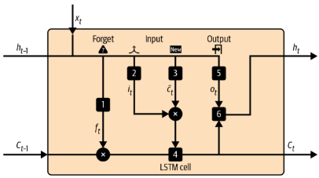
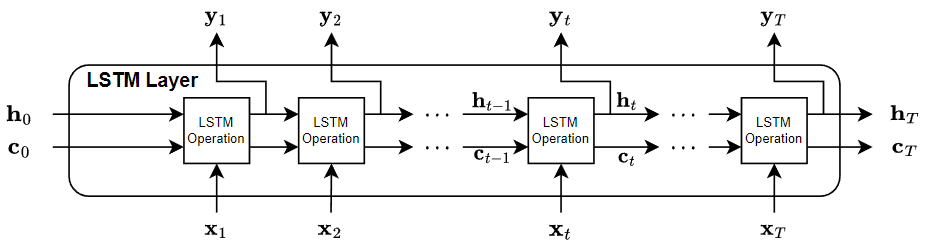
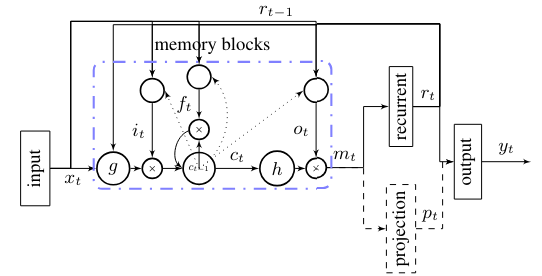
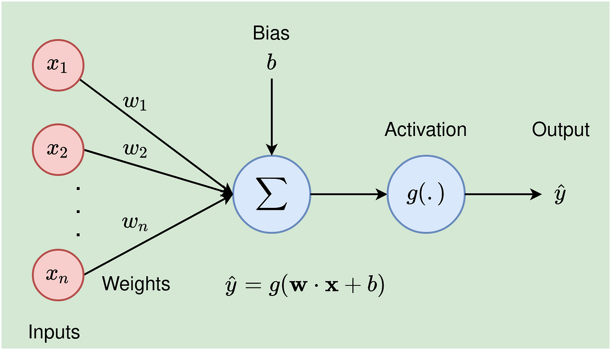

# Long Short-Term Memory
## 簡介
Long Short-Term Memory(LSTM) 的組成:  
- Input Gate: 輸入  
- Output Gate: 輸出  
- Memroy Cell: 記憶單元  
- Forget Gate: 記憶或是遺忘  

## 架構  
### LSTM Cell  
#### 單一狀態的 LSTM    
  
- 1.$f_{t}=\sigma \left ( W_{f}\cdot \left [ h_{t-1},x_{t} \right ]+b_{f}\right )$  
- 2.$i_{t}=\sigma \left ( W_{i}\cdot \left [ h_{t-1},x_{t} \right ]+b_{i}\right )$  
- 3.$\widetilde{C_{t}}=tanh\left ( W_{C}\cdot \left [ h_{t-1},x_{t} \right ]+b_{C} \right ) $  
- 4.$C_{t}=f_{t}*C_{t-1}+i_{t}*\widetilde{C_{t}}$  
- 5.$o_{t}=\sigma \left ( W_{o}\cdot \left [ h_{t-1},x_{t} \right ]+b_{o}\right )$  
- 6.$h_{t}=o_{t}*tanh(C_{t})$  

### LSTM  
#### 多層 LSTM Cell 組成  
  

## 論文探討   
[LSTM Paper](<https://arxiv.org/abs/1402.1128> "論文出處")  

### LSTM based RNN architectures  
   
- $i_{t}=\sigma \left ( W_{ix}x_{t}+W_{ir}r_{t-1}+W_{ic}c_{t-1}+b_{i}\right )$  
- $f_{t}=\sigma \left ( W_{fx}x_{t}+W_{rf}r_{t-1}+W_{cf}c_{t-1}+b_{f}\right )$  
- $c_{t}=f_{t} \odot c_{t-1} + i_{t} \odot g \left ( W_{cx}x_{t}+W_{cr}r_{t-1}+b_{c}\right )$   
- $o_{t}=\sigma \left ( W_{ox}x_{t}+W_{or}r_{t-1}+W_{oc}c_{t}+b_{o}\right )$   
- $m_{t}=o_{t} \odot h(c_{t})$   
- $r_{t}=W_{rm}m_{t}$    
- $p_{t}=W_{pm}m_{t}$  
- $y_{t}=W_{yr}r_{t}+W_{yp}p_{t}+b_{y}$  

### 流程分析  
#### 權重(忽略偏差量)   
- The total number of parameters W(標準 LSTM network)  
$W=n_{c}\times n_{c}\times 4+n_{i}\times n_{c}\times 4+n_{c}\times n_{o}+n_{c}\times 3$   
    ```
    nc: the number of memory cells(memory blocks)  
    ni: the number of input units  
    no: the number of output units
    ```   
    - 問題  
        1.使用隨機梯度下降法優化 LSTM 模型，會導致每個時間狀態下的learning computational complexity(學習運算複雜度)為 O(W)  
        2.輸入的信息量較少時，會使 LSTM 訓練成本與信息量不成正比(耗費大量的儲存單元)  
##### 解決辦法  
- 架構一：單元輸出連到遞歸預測層(用於預測輸出單元)  
$W=n_{c}\times n_{r}\times 4+n_{i}\times n_{c}\times 4+n_{r}\times n_{o}+n_{c}\times n_{r}+n_{c}\times 3$
    ```
    nr: 遞歸預測層的單元數  
    ```  

- 架構二：基於架構一，額外增加非遞歸預測層(不增加參數的情況下增加預測層的單元數)   
$W=n_{c}\times n_{r}\times 4+n_{i}\times n_{c}\times 4+(n_{r}+n_{p})\times n_{o}+n_{c}\times (n_{r}+n_{p})+n_{c}\times 3$  
    ```
    np: 非遞歸預測層的單元數
    ```  

### 參數  
- W: 權重矩陣(Wix: weights from the input gate to the input)  
- b: bias(偏差) vectors (bi: the input gate bias vector)  
- $\sigma $: logistic sigmoid function  
- i,o,f: input gate, forget gate, output gate  
- c: cell activation vectors  
- m: cell output activation vector  
- r: recurrent unit activations  
- p: optional non-recurrent unit activations  
- g,h: cell input and cell output activation functions  

  

## 程式碼解析     
### LSTM Cell  
- Tensorflow source   
[Tensorflow source](<https://github.com/keras-team/keras/blob/v3.3.3/keras/src/layers/rnn/lstm.py#L318-L669> "Tensorflow source")  

```python
from keras.src import activations
from keras.src import backend
from keras.src import constraints
from keras.src import initializers
from keras.src import ops
from keras.src import regularizers
from keras.src import tree
from keras.src.api_export import keras_export
from keras.src.layers.input_spec import InputSpec
from keras.src.layers.layer import Layer
from keras.src.layers.rnn.dropout_rnn_cell import DropoutRNNCell
from keras.src.layers.rnn.rnn import RNN


@keras_export("keras.layers.LSTMCell")
class LSTMCell(Layer, DropoutRNNCell):
    #參數初始化
    def __init__(
        self,
        units,
        activation="tanh",
        recurrent_activation="sigmoid",
        use_bias=True,
        kernel_initializer="glorot_uniform",
        recurrent_initializer="orthogonal",
        bias_initializer="zeros",
        unit_forget_bias=True,
        kernel_regularizer=None,
        recurrent_regularizer=None,
        bias_regularizer=None,
        kernel_constraint=None,
        recurrent_constraint=None,
        bias_constraint=None,
        dropout=0.0,
        recurrent_dropout=0.0,
        seed=None,
        **kwargs,
    ):
        if units <= 0: #單元不能為0
            raise ValueError(
                "Received an invalid value for argument `units`, "
                f"expected a positive integer, got {units}."
            )
        implementation = kwargs.pop("implementation", 2)
        super().__init__(**kwargs)
        self.units = units
        self.activation = activations.get(activation)
        self.recurrent_activation = activations.get(recurrent_activation)
        self.use_bias = use_bias

        self.kernel_initializer = initializers.get(kernel_initializer)
        self.recurrent_initializer = initializers.get(recurrent_initializer)
        self.bias_initializer = initializers.get(bias_initializer)

        self.kernel_regularizer = regularizers.get(kernel_regularizer)
        self.recurrent_regularizer = regularizers.get(recurrent_regularizer)
        self.bias_regularizer = regularizers.get(bias_regularizer)

        self.kernel_constraint = constraints.get(kernel_constraint)
        self.recurrent_constraint = constraints.get(recurrent_constraint)
        self.bias_constraint = constraints.get(bias_constraint)

        self.dropout = min(1.0, max(0.0, dropout))
        self.recurrent_dropout = min(1.0, max(0.0, recurrent_dropout))
        self.seed = seed
        self.seed_generator = backend.random.SeedGenerator(seed=seed)

        self.unit_forget_bias = unit_forget_bias
        self.state_size = [self.units, self.units]
        self.output_size = self.units
        self.implementation = implementation

    #建構 LSTM ,對應上述公式及圖片
    def build(self, input_shape):
        super().build(input_shape)
        input_dim = input_shape[-1]
        self.kernel = self.add_weight(
            shape=(input_dim, self.units * 4),
            name="kernel",
            initializer=self.kernel_initializer,
            regularizer=self.kernel_regularizer,
            constraint=self.kernel_constraint,
        )
        self.recurrent_kernel = self.add_weight(
            shape=(self.units, self.units * 4),
            name="recurrent_kernel",
            initializer=self.recurrent_initializer,
            regularizer=self.recurrent_regularizer,
            constraint=self.recurrent_constraint,
        )

        #當使用偏差時
        if self.use_bias:
            if self.unit_forget_bias:

                def bias_initializer(_, *args, **kwargs):
                    return ops.concatenate(
                        [
                            self.bias_initializer(
                                (self.units,), *args, **kwargs
                            ),
                            initializers.get("ones")(
                                (self.units,), *args, **kwargs
                            ),
                            self.bias_initializer(
                                (self.units * 2,), *args, **kwargs
                            ),
                        ]
                    )

            else:
                bias_initializer = self.bias_initializer
            self.bias = self.add_weight(
                shape=(self.units * 4,),
                name="bias",
                initializer=bias_initializer,
                regularizer=self.bias_regularizer,
                constraint=self.bias_constraint,
            )
        else:
            self.bias = None
        self.built = True

    #依照公式進行運算(輸入時的時間狀態)
    def _compute_carry_and_output(self, x, h_tm1, c_tm1):
        """Computes carry and output using split kernels."""
        x_i, x_f, x_c, x_o = x
        h_tm1_i, h_tm1_f, h_tm1_c, h_tm1_o = h_tm1
        i = self.recurrent_activation(
            x_i + ops.matmul(h_tm1_i, self.recurrent_kernel[:, : self.units])
        )
        f = self.recurrent_activation(
            x_f
            + ops.matmul(
                h_tm1_f, self.recurrent_kernel[:, self.units : self.units * 2]
            )
        )
        c = f * c_tm1 + i * self.activation(
            x_c
            + ops.matmul(
                h_tm1_c,
                self.recurrent_kernel[:, self.units * 2 : self.units * 3],
            )
        )
        o = self.recurrent_activation(
            x_o
            + ops.matmul(h_tm1_o, self.recurrent_kernel[:, self.units * 3 :])
        )
        return c, o

    #運算完的時間狀態
    def _compute_carry_and_output_fused(self, z, c_tm1):
        """Computes carry and output using fused kernels."""
        z0, z1, z2, z3 = z
        i = self.recurrent_activation(z0)
        f = self.recurrent_activation(z1)
        c = f * c_tm1 + i * self.activation(z2)
        o = self.recurrent_activation(z3)
        return c, o
    # call function
    def call(self, inputs, states, training=False):
        h_tm1 = states[0]  # previous memory state
        c_tm1 = states[1]  # previous carry state

        dp_mask = self.get_dropout_mask(inputs)
        rec_dp_mask = self.get_recurrent_dropout_mask(h_tm1)

        if training and 0.0 < self.dropout < 1.0:
            inputs = inputs * dp_mask
        if training and 0.0 < self.recurrent_dropout < 1.0:
            h_tm1 = h_tm1 * rec_dp_mask

        if self.implementation == 1:
            inputs_i = inputs
            inputs_f = inputs
            inputs_c = inputs
            inputs_o = inputs
            k_i, k_f, k_c, k_o = ops.split(self.kernel, 4, axis=1)
            x_i = ops.matmul(inputs_i, k_i)
            x_f = ops.matmul(inputs_f, k_f)
            x_c = ops.matmul(inputs_c, k_c)
            x_o = ops.matmul(inputs_o, k_o)
            if self.use_bias:
                b_i, b_f, b_c, b_o = ops.split(self.bias, 4, axis=0)
                x_i += b_i
                x_f += b_f
                x_c += b_c
                x_o += b_o

            h_tm1_i = h_tm1
            h_tm1_f = h_tm1
            h_tm1_c = h_tm1
            h_tm1_o = h_tm1
            x = (x_i, x_f, x_c, x_o)
            h_tm1 = (h_tm1_i, h_tm1_f, h_tm1_c, h_tm1_o)
            c, o = self._compute_carry_and_output(x, h_tm1, c_tm1)
        else:
            z = ops.matmul(inputs, self.kernel)

            z += ops.matmul(h_tm1, self.recurrent_kernel)
            if self.use_bias:
                z += self.bias

            z = ops.split(z, 4, axis=1)
            c, o = self._compute_carry_and_output_fused(z, c_tm1)

        h = o * self.activation(c)
        return h, [h, c]
    #獲取參數數值
    def get_config(self):
        config = {
            "units": self.units,
            "activation": activations.serialize(self.activation),
            "recurrent_activation": activations.serialize(
                self.recurrent_activation
            ),
            "use_bias": self.use_bias,
            "unit_forget_bias": self.unit_forget_bias,
            "kernel_initializer": initializers.serialize(
                self.kernel_initializer
            ),
            "recurrent_initializer": initializers.serialize(
                self.recurrent_initializer
            ),
            "bias_initializer": initializers.serialize(self.bias_initializer),
            "kernel_regularizer": regularizers.serialize(
                self.kernel_regularizer
            ),
            "recurrent_regularizer": regularizers.serialize(
                self.recurrent_regularizer
            ),
            "bias_regularizer": regularizers.serialize(self.bias_regularizer),
            "kernel_constraint": constraints.serialize(self.kernel_constraint),
            "recurrent_constraint": constraints.serialize(
                self.recurrent_constraint
            ),
            "bias_constraint": constraints.serialize(self.bias_constraint),
            "dropout": self.dropout,
            "recurrent_dropout": self.recurrent_dropout,
            "seed": self.seed,
        }
        base_config = super().get_config()
        return {**base_config, **config}
    #獲取初始狀態
    def get_initial_state(self, batch_size=None):
        return [
            ops.zeros((batch_size, d), dtype=self.compute_dtype)
            for d in self.state_size
        ]
```  

- Pytorch source   
[Pytorch source](<https://pytorch.org/docs/stable/_modules/torch/nn/modules/rnn.html#LSTMCell> "Pytorch source")  
[Pytorch LSTM CPP source](<https://github.com/pytorch/pytorch/blob/main/aten/src/ATen/native/RNN.cpp> "Pytorch LSTM CPP source")  
```python
import math
import warnings
import numbers
import weakref
from typing import List, Tuple, Optional, overload

import torch
from torch import Tensor
from .module import Module
from ..parameter import Parameter
from ..utils.rnn import PackedSequence
from .. import init
from ... import _VF #https://github.com/pytorch/pytorch/blob/main/aten/src/ATen/native/RNN.cpp
class LSTMCell(RNNCellBase):
    def __init__(self, input_size: int, hidden_size: int, bias: bool = True,
                 device=None, dtype=None) -> None:
        factory_kwargs = {'device': device, 'dtype': dtype}
        super().__init__(input_size, hidden_size, bias, num_chunks=4, **factory_kwargs)

    def forward(self, input: Tensor, hx: Optional[Tuple[Tensor, Tensor]] = None) -> Tuple[Tensor, Tensor]:
        if input.dim() not in (1, 2):
            raise ValueError(f"LSTMCell: Expected input to be 1D or 2D, got {input.dim()}D instead")
        if hx is not None:
            for idx, value in enumerate(hx):
                if value.dim() not in (1, 2):
                    raise ValueError(f"LSTMCell: Expected hx[{idx}] to be 1D or 2D, got {value.dim()}D instead")
        is_batched = input.dim() == 2
        if not is_batched:
            input = input.unsqueeze(0)

        if hx is None:
            zeros = torch.zeros(input.size(0), self.hidden_size, dtype=input.dtype, device=input.device)
            hx = (zeros, zeros)
        else:
            hx = (hx[0].unsqueeze(0), hx[1].unsqueeze(0)) if not is_batched else hx
        # 運算式
        ret = _VF.lstm_cell(
            input, hx,
            self.weight_ih, self.weight_hh,
            self.bias_ih, self.bias_hh,
        )

        if not is_batched:
            ret = (ret[0].squeeze(0), ret[1].squeeze(0))
        return ret
```  

### 實作  
#### 環境配置  
```
Ubuntu 22.04.4 LTS  
conda 24.5.0
Python 3.10.14
Pytorch 2.3.1  
tensorflow 2.16.1
```
- Pytorch   
[LSTM.py](LSTM.py)  

