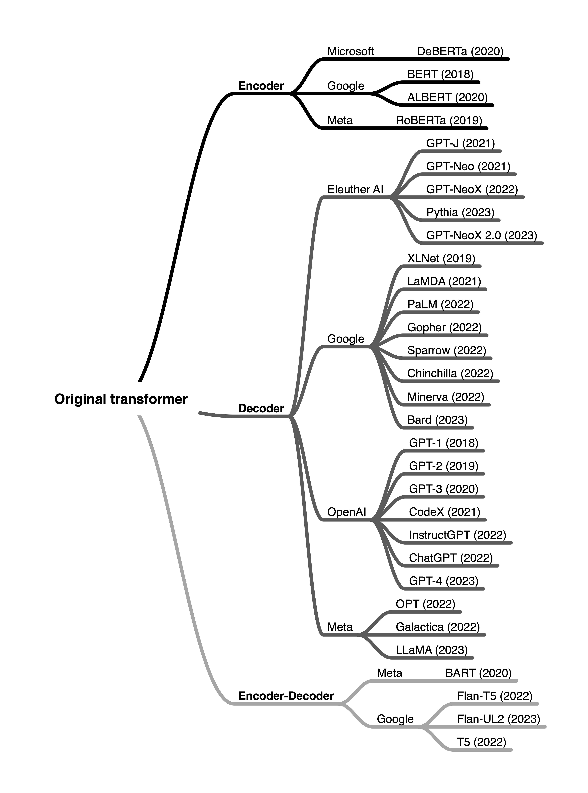
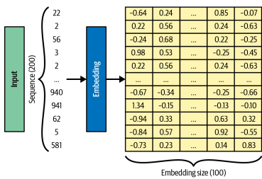

# LLM
## Transformer  
- 語言模型分布  
    
```
透過依賴注意力機制(attention mechanisms)來建構模型，
依靠自注意力(Self-attention)來算輸入及輸出，
取代了 RNN 及 LSTM 的序列運算，並且不需要 RNN 跟卷積(convolution)。
備註: RNN、LSTM 等，都會有序列運算最基本的限制。 
自注意力: 將單個序列中不同索引位置的內容連接，方便特徵計算。
```    
- 架構圖  
 

<div style="break-after: page; page-break-after: always;"></div> 

### Encoder and Decoder  
Transformer 可分為2個部分：  
- Encoder(==N(層數) = 6==)，每層內含(Two sublayers):  
    - Multi-head Attention:  
        ```
        流程:  
        輸入(偏移內容)  
        -> 此子層(output)  
        -> residual(殘差) connection+layer normalization  
        -> Fully Connected Feed-Forward Network(input)  
        ```  

    - Fully Connected Feed-Forward Network(全連接前饋式網路):  
        ```
        流程:  
        -> 輸入內容(前一子層輸出)  
        -> 此子層(Output)  
        -> residual(殘差) connection+layer normalization  
        -> output or (Input Decoder Multi-Head Attention Sub-layer)  
        ```  
    ``` 
    備註：  
    為了方便 residual(殘差) connection ， Encoder 內 (all sublayers and Embedding layers) 的輸出維度(dimension) 皆為 dmodel = 512  
    ```  
    子層的輸出(Output)：  
    $LayerNorm \left ( x + Sublayer\left ( x \right ) \right )$  

<div style="break-after: page; page-break-after: always;"></div> 

- Decoder(N(層數) = 6)，每層內含(Three sublayers):  
    ```
    比 Encoder 多加了一層(sublayer)
    ```
    - Masked Multi-Head Attention:  
        ```
        作用: 防止注意力關注到後續的位置   
        改良方式(由 Multi-Head Attention):  
        將輸入內容進行遮罩(預測第X個位置時，只能參考 index(X) 之前索引的內容)  

        流程:    
        輸入(偏移內容)  
        -> 此子層(output)  
        -> residual(殘差) connection+layer normalization  
        -> Multi-head Attention(input)  
        ```
    
    - Multi-head Attention:  
        ```
        與 Encoder 不同，此子層會輸入(Encoder Output+Masked Multi-head Attention Output)  

        流程:  
        輸入(Encoder Output + 前一子層輸出)  
        -> 此子層(output)  
        -> residual(殘差) connection+layer normalization  
        -> Fully Connected Feed-Forward Network(input)  
        ```  

    - Fully Connected Feed-Forward Network(全連接前饋式網路):  
        ```
        流程:  
        輸入(前一子層輸出)  
        -> 此子層(output)  
        -> residual(殘差) connection+layer normalization  
        -> output
        ```  

<div style="break-after: page; page-break-after: always;"></div> 

### Attention
  

#### Scaled Dot-Product Attention
```
類似於 dot-product (multiplicative) attention
```
$Attention(Q,K,V)=softmax(\frac{QK^{T}}{\sqrt{d_{k}}})V$ 
- 注意力權重： $softmax(\frac{QK^{T}}{\sqrt{d_{k}}})$  

- $\sqrt{d_{k}}$ 的重要性：  
$d_{k}$較大時，點積運算毀使幅度越來越大，將 softmax() 引導至梯度極小值的區域，所以需要 $\sqrt{d_{k}}$ 來對點積進行縮放。  

- Q、K、V 皆為矩陣  

<div style="break-after: page; page-break-after: always;"></div> 

#### Multi-Head Attention
改善單頭注意力模式下，平均化抑制注意力權重的問題：  
1.將 Q,K,V 投影至 $d_{k},d_{k},d_{v}$  
2.$d_{k},d_{k},d_{v}$  並行執行注意力函數，取得 $d_{v}$ 的輸出值  
```
允許模型在不同位置共同關注來自不同特徵子空間的資訊。
    
Transformer 中的使用方式:
1. Encoder-Decoder layer: 
使得解碼器中的每個位置都能專注於輸入序列中的所有位置。(模仿 cross-attention)

2. self-attention layer:
讓 Encoder 中的每個位置都可以專注於編碼器上一層的所有位置。

3. Dncoder:
與 Encoder 中 self-attention layer 一樣，但需要防備信息回流(保持 Autoregressive)。
防備方式: 
屏蔽（設定為-∞）softmax() 中所有對應於錯誤的值，才能在 Scaled Dot-Product Attention 實現。
```

$$MultiHead(Q,K,V) = Concat(head_{1}, ..., head_{h})W^{o}$$  

where $$headi = Attention(QW_{i}^{Q},KW_{i}^{K},VW_{i}^{V})$$  

$$W_{i}^{Q}\in \mathbb{R}^{d_{model}\times d_{k}},W_{i}^{K}\in \mathbb{R}^{d_{model}\times d_{k}},W_{i}^{V}\in \mathbb{R}^{d_{model}\times d_{k}},W^{o}\in \mathbb{R}^{hd_{model}\times d_{k}}$$  

<script type="text/javascript" src="http://cdn.mathjax.org/mathjax/latest/MathJax.js?config=TeX-AMS-MML_HTMLorMML"></script>
<script type="text/x-mathjax-config"> MathJax.Hub.Config({ tex2jax: {inlineMath: [['$', '$']]}, messageStyle: "none" });</script>

### Position-wise Feed-Forward Networks
```
架構: 
線性變換 2 次，(ReLU) 1 次
input and output (dmodel = 512)，內層維度(2048)

作用:
除了 (attention-sublayer)外，每層都包含一個 (fully connected feed-forward network)
每個位置使用的參數皆不同(two convolutions with kernel=1 * 1)
```  
$$FFN(x) = max(0, xW_{1} + b_{2})W_{2} + b_{2}$$  

$$ReLU = max(0, xW_{1} + b_{2})$$  

<script type="text/javascript" src="http://cdn.mathjax.org/mathjax/latest/MathJax.js?config=TeX-AMS-MML_HTMLorMML"></script>
<script type="text/x-mathjax-config"> MathJax.Hub.Config({ tex2jax: {inlineMath: [['$', '$']]}, messageStyle: "none" });</script>

<div style="break-after: page; page-break-after: always;"></div> 

### Embeddings and Softmax

#### embedding  
  
  
```
作用:
將多個序列內容轉換成數值矩陣方便後續運算
```  

#### softmax  
```
備註:假設矩陣為2維

維度為0的元素相加等於1
tensor([[[0.5000, 0.5000, 0.5000],
        [0.5000, 0.5000, 0.5000]],

        [[0.5000, 0.5000, 0.5000],
        [0.5000, 0.5000, 0.5000]]])
規律: (0,0,0)+(1,0,0)=1, (0,0,1)+(1,0,1)=1, (0,0,2)+(1,0,2)=1, (0,1,0)+(1,1,0), 以此類推...

維度為1的元素相加等於1
tensor([[[0.7987, 0.9347, 0.1956],
        [0.2013, 0.0653, 0.8044]],

        [[0.7987, 0.9347, 0.1956],
        [0.2013, 0.0653, 0.8044]]])
規律: (0,0,0)+(0,1,0)=1, (0,0,1)+(0,1,1)=1, (0,0,2)+(0,1,2)=1, 以此類推...

維度為2的元素相加等於1
tensor([[[0.4866, 0.4218, 0.0916],
        [0.2319, 0.0557, 0.7124]],

        [[0.4866, 0.4218, 0.0916],
        [0.2319, 0.0557, 0.7124]]])
```  
$$Softmax(x_{i})=\frac{exp(x_{i})}{\sum_{j=1}^{n}exp(x_{j})}$$  

<script type="text/javascript" src="http://cdn.mathjax.org/mathjax/latest/MathJax.js?config=TeX-AMS-MML_HTMLorMML"></script>
<script type="text/x-mathjax-config"> MathJax.Hub.Config({ tex2jax: {inlineMath: [['$', '$']]}, messageStyle: "none" });</script>

<div style="break-after: page; page-break-after: always;"></div> 

#### Transformer 中的作用  
```
從 (Enbedding layer) 到 (softmax()) 中間皆共享相同的權重。
```  
(Enbedding layer) 將所有權重進行了處理: $weight * \sqrt{d_{model}}$   
<script type="text/javascript" src="http://cdn.mathjax.org/mathjax/latest/MathJax.js?config=TeX-AMS-MML_HTMLorMML"></script>
<script type="text/x-mathjax-config"> MathJax.Hub.Config({ tex2jax: {inlineMath: [['$', '$']]}, messageStyle: "none" });</script>

### Positional Encoding  
  
 
$PE_{(pos,2i)} = sin(pos/10000^{2i/dmodel})$
$PE_{(pos,2i+1)} = cos(pos/10000^{2i/dmodel})$  

<script type="text/javascript" src="http://cdn.mathjax.org/mathjax/latest/MathJax.js?config=TeX-AMS-MML_HTMLorMML"></script>
<script type="text/x-mathjax-config"> MathJax.Hub.Config({ tex2jax: {inlineMath: [['$', '$']]}, messageStyle: "none" });</script>

```
能夠使 Transformer 利用序列的順序來做訓練，
使用 (Positional Encoding) 運算出的矩陣中含有相對(絕對)位置的信息(再 Transformer 中)是使用正弦波的方式做運算，
有2個優點: 
1. 遇到位置偏移時的損失較小
2. 容易推斷出較長的序列(比訓練時的序列更長)
```

<div style="break-after: page; page-break-after: always;"></div> 

### Self-Attention  
```
使用動機: 
1. 每層的總計算複雜度(complexity per layer)
2. 並行化的計算量，以所需的最小計算量來衡量
3. 網路(模型)中長距離依賴關係之間的路徑長度

(long-range dependencies) 是序列轉換的關鍵，其中(輸入及輸出)序列中任意組合之間的路徑尤為重要，路徑越短，越容易學到長距離的依賴關係。

與卷積層和遞歸層做比較: 
1. 當序列長度 n 小於維度 d 時，自註意層的計算速度要快於遞歸層
2. 卷積層：
kernel width k < n 時: 無法連接所有 (pairs of input and output) 
contiguous kernels(核連續): 需要堆疊 O(n/k) 個卷積層  
dilated convolutions(核擴張): 需要堆疊 O(logk(n)) 個卷積層
3.因為一般卷積層的計算量太大，所以採用類似可分離卷積層(Separable convolutions)的方式(可分離卷積層的計算量相當於 a self-attention layer and a point-wise feed-forward layer 的組合)

總結: 
self-attention 可以更好的訓練出能被解釋的模型，
檢查注意力的分布符不符合實際情況並做出探討及修改，
就能使 (attention heads) 表現出文法及語意結構的正相關
每個 (attention heads) 都能學會不同的訓練任務
```  

<div style="break-after: page; page-break-after: always;"></div> 

#### Separable convolutions 的複雜度  
$$O(k · n · d + n · d^{2})$$  

#### Separable convolutions  
  

#### Contiguous kernels  
  

#### Dilated convolutions  
  

<div style="break-after: page; page-break-after: always;"></div> 

### Decoder-only Model
#### 架構圖  
  

```
我的想法:
Decoder-only 包含了 (Encoder-only 及 Encoder-Decoder) 的功能，是現在熱門的幾種語言模型架構
優點: 
利用了 Causal Mask 來進行遮罩，是 (Encoder-only 及 Encoder-Decoder) 所沒有的過程

缺點: 
1. Decoder-only 的注意力無法按比例的分配給輸入序列中的標點符號或特殊符號(softmax 的運算規則導致)
2. 不同長度的序列會導致注意力分配極度不成比例 
3. 無法準確得知到序列中字詞的位置
4. RPE(Relative positional encoding) 無法捕捉到絕對的位置資訊,因為Transformer 的 softmax() 會生成右隨機矩陣 
```  

<div style="break-after: page; page-break-after: always;"></div> 

### Cross Attention
```
使用於 Encoder-Decoder, 對 machine translation 極為重要(與 self-attention 相比)

與 self-attention 的差異:  
1.cross-attention 要注意 pruning 的使用(cross-attention 對 pruning 非常的敏感,過度使用會導致品質下降)  
2. 無法使用對應方法替代(hard-coded),不會影響性能(替代方法舉例: input-independent Gaussian distribution)
```
  

#### pruning
```
定義: 一種模型壓縮的方式，有效地精簡模型參數並最小化損失。  

應用:  
1.多層感知機(MLP)  
2.卷積神經網路(CNN)   
3.機器翻譯(MT)

運用在 machine translation 的效果:
transfer learning(遷移學習): 分別訓練(parent model and child model)  
1. parent model(high-resource language pair):  
用於資料較多(parallel data)的語言  

2. child model(low-resource language pair):  
用於新的語言或是資料較少(parallel data)的語言 

好處:
1.減少災難性遺忘(catastrophic forgetting)的可能性
2.開發出不需要樣本即可翻譯的潛能
3.可翻譯多種語言，並減少儲存參數的消耗
```  

<div style="break-after: page; page-break-after: always;"></div> 

#### transfer learning(遷移學習)
  
- a. 從頭完整訓練模型  
- b. 標準方式微調(fine-tuning)模型(src+body)  
- c. 使用(cross-attention)微調模型(src+xattn)  
- d. fine-tuning new vocabulary (src)
- e. 進行語言翻譯時，微調 cross-attention（tgt+xattn）  
- f. 從頭更新 (cross-attention) 的遷移學習(transfer learning)  
    ```
    虛線: 隨機初始化。  
    實線: 初始化(預訓練模型參數)。  
    陰影部分(or)下底線部分: 進行微調。  
    剩餘部分不看。  
    ```  


<div style="break-after: page; page-break-after: always;"></div> 

##### 定義  
###### parent model 的訓練集 
格式: ($x_{s_{p}}$, $y_{t_{p}}$)  

- $s_{p}$: source sentences   

- $t_{p}$: target sentences  

- fine-tuning: 從 $f_{\theta}$ 取得 parameters $\theta$, 來初始化 model $g_{\theta}$  

- $g_{\theta}$:  利用 child model 進行優化(收斂至 $g_{\phi}$)  


###### child model 的訓練集  
格式:($x_{s_{c}}$, $y_{t_{c}}$)  

- $s_{c}$: source sentences   
- $t_{c}$: target sentences   

假設:  

- $s_{c}$ = $s_{p}$  
- $t_{c}$ = $t_{p}$  

<div style="break-after: page; page-break-after: always;"></div> 

- $\theta$:  
$$\theta = \bigcup \lbrace \theta _{src},\theta _{tgt},\theta _{enc},\theta _{dec},\theta _{xattn} \rbrace$$  
- $\theta _{src}$(來源):  
    ```
    includes  
    source-language token embeddings,  
    source positional embeddings,  
    source embeddings layer norm parameters 
    ```  
- $\theta _{tgt}$(目標):  
    ```
    includes  
    target-language (tied) input and output token embeddings,  
    target positional embeddings,  
    target embeddings layer norm parameters  
    ```  
- $\theta _{enc}$(encoder):  
    ```
    includes  
    self-attention,  
    layer norm,  
    feed-forward parameters  
    ```  
- $\theta _{dec}$(decoder):  
    ```
    includes  
    selfattention,  
    layer norm,  
    feed-forward parameters  
    ```  
- $\theta _{xattn}$(cross attention):  
    ```
    includes  
    crossattention  
    corresponding layer norm parameters  　
    ```  

<div style="break-after: page; page-break-after: always;"></div> 

#### 何謂災難性遺忘(catastrophic forgetting)
```
定義: 當模型接受到新資訊來訓練時，已掌握資料的訓練品質會因此下降(會遺忘先前某些部分的記憶)

影響:  
1.訓練資源的訓練效率較低  
2.抑制模型自我學習的行為  
3.會讓大型模型無法正常訓練  

改善方式:  
1.建立資料暫存區,讓模型不會因為遺忘先前的資料而導致效率低  
2.在(loss function)中加入懲罰項，限制訓練過程中的權重更變(利於保留先前知識)  
3.使外部記憶組件的模型能選擇保留先前任務中的重要資訊  
4.動態調整權重，讓模型能適應新的訓練資料(防止遺忘)
```  

<script type="text/javascript" src="http://cdn.mathjax.org/mathjax/latest/MathJax.js?config=TeX-AMS-MML_HTMLorMML"></script>
<script type="text/x-mathjax-config"> MathJax.Hub.Config({ tex2jax: {inlineMath: [['$', '$']]}, messageStyle: "none" });</script>