# Transformer

```
依賴版本:
torch==2.3.1
python==3.10.12
```  

## 依賴  
```py
from torch.autograd import Variable
from torch import nn
import torch.nn.functional as function
import torch
import math
import copy
```  

## Embedding(嵌入向量)  
```py
class Embedding(nn.Module):
def __init__(self, vocab_size, d_model = 512):
    super().__init__() #調用 nn.Module, 不被覆蓋
    self.embed = nn.Embedding(vocab_size, d_model)
def forward(self, x):
    return self.embed(x)
```  
```
Embedding 的工作是將序列轉成詞模組(序列建議用 one hot vector),一個字轉為一個數值序列,將很多字的句子轉為多個數值序列
```  

<div style="break-after: page; page-break-after: always;"></div> 

### nn.Embedding  
```py
embedding = nn.Embedding(10, 3)
input = torch.LongTensor([[1, 2, 4, 5], [4, 3, 2, 9]])
embedding(input)
"""
output:
tensor([[[-0.0251, -1.6902,  0.7172],
        [-0.6431,  0.0748,  0.6969],
        [ 1.4970,  1.3448, -0.9685],
        [-0.3677, -2.7265, -0.1685]],

        [[ 1.4970,  1.3448, -0.9685],
        [ 0.4362, -0.4004,  0.9400],
        [-0.6431,  0.0748,  0.6969],
        [ 0.9124, -2.3616,  1.1151]]])
"""
```
```
個人想法:
nn.Embedding 是 pytorch 所開發幫助轉化為詞模組的工具，
需要先定義模組大小,以上例為例,模組大小(可放 Tensor*10, 每個 Tensor 的內容大小為 3)，
再來是輸入的序列,以句子為單位,一句一個序列,序列內容為詞語(需轉換為純數值才能使寫入序列中,推薦用 one-hot)，
最後就是輸出, nn.Embedding 會將每句(每個序列)中的每個數值都轉換成序列,這樣就會有詳細的信息方便後續作處理(例如:Position_Encoder)
```

<div style="break-after: page; page-break-after: always;"></div> 

## Position_Encoder(位置編碼)  
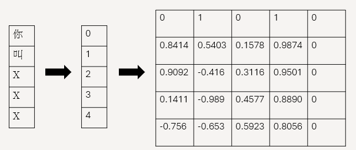  

```py
class PositionalEncoder(nn.Module):
def __init__(self, d_model = 512, max_seq_len = 200):
    super().__init__()
    self.d_model = d_model

    PE = torch.zeros(max_seq_len, d_model)
    for pos in range(max_seq_len):
        for i in range(0, d_model, 2):
            PE[pos, i] = math.sin(pos / (10000 ** ((2 * i)/d_model)))
            PE[pos, i + 1] = math.cos(pos / (10000 ** ((2 * (i + 1))/d_model)))
            
    PE = PE.unsqueeze(0) #將第0維新增一個維度: (max_seq_len*d_model) -> (1*max_seq_len*d_model)
    self.register_buffer('PE', PE) # self.pe = pe

def forward(self, PE_output):
    # 擃大 Embedding,確保原本的信息不會丟失
    PE_output = PE_output * math.sqrt(self.d_model)
    seq_size = PE_output.size(1)
    PE_output = PE_output + Variable(self.pe[:,:seq_size], requires_grad=False).cuda() # 自變數
    return PE_output
```
```
個人想法:
Position_Encoder(位置編碼) 是 Transformer 中很重要的功能，可以讓模型知道句子的語法順序及語義(語言模型必須要有的邏輯)，
但缺點就是會使注意力分配不均,再 stableMask 的論文中就有說到如何再 Decoder-only 的狀態下進行改善
補充: Variable() 是能進行自我迭代的函數,數值會一直進行變化,也就是數學中的自變數
```  

<div style="break-after: page; page-break-after: always;"></div> 

## attention(注意力算法)
```py
def Scaled_Dot_Product_attention(q, k, v, dk, mask=None, dropout=None):
    scores = torch.matmul(q, k.T) /  math.sqrt(dk)
    if mask is not None:
        mask = mask.unsqueeze(1) # 在第一維增加一個維度
        scores = scores.masked_fill(mask == 0, -1e9) # masking
    scores = function.softmax(scores, dim=-1) 

    if dropout is not None:
        scores = dropout(scores)
    
    output = torch.matmul(scores, v)
    return output
```
```
個人想法:
Scaled Dot Product attention 的算法是注意力中最基礎的算法, 但也相對於 (Multi-Head Attention) 來說,較多缺點:
1.只能單 head 輸入
2.效率較低,無法同時處理不同的任務
3.會壓制到注意力權重
基於上述幾個缺點使得當今的語言模型都不會以 Scaled Dot Product attention 作為主要算法,需要進行改善才能使用
```
### Mask
```py
import torch

if __name__ == '__main__':
    origin = torch.arange(0,64).view(8,8)
    print('origin\n{}\n'.format(origin))

    mask = torch.eye(8,dtype=torch.bool)
    print('mask\n{}\n'.format(mask))

    fill = tensor.masked_fill(mask,0)
    print('fill\n{}'.format(fill))
```  

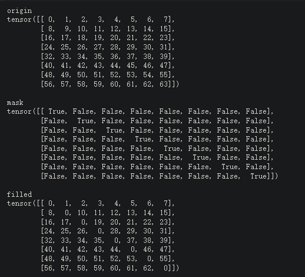  


```
個人想法:
Mask 是語言模型數一數二重要的訓練方式,透過遮住後面的訊息,來使語言模型能更貼近人的語言思維及邏輯,
就如同 GPT2 使用的 causal mask,或者是 Decoder-only 改良的 StableMask 都是靠著遮罩來實現語言模型的訓練,
上面的範例是呈現 (Mask) 是如何進行的
```  

<div style="break-after: page; page-break-after: always;"></div> 

### multiple-heads Attention  
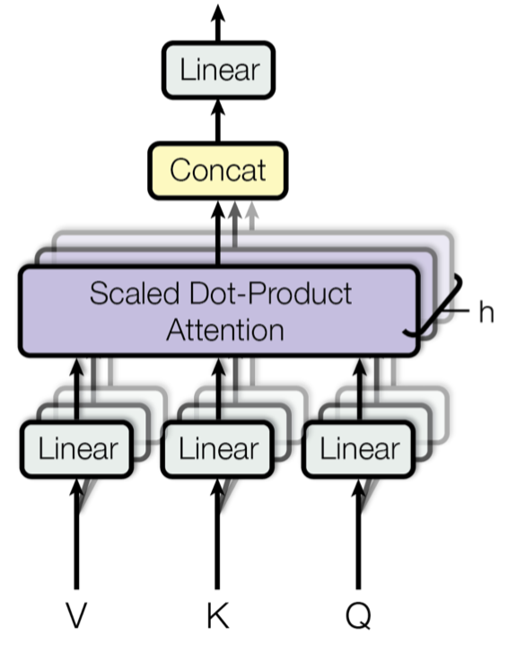  

```py
class MultiHeadAttention(nn.Module):
def __init__(self, heads = 8, d_model = 512, dropout = 0.3):
    super().__init__()
    self.d_model = d_model
    self.d_k = d_model // heads
    self.h = heads
    # Q,K,V: d_model * d_model(全連階層)
    self.Q_linear = nn.Linear(d_model, d_model)
    self.V_linear = nn.Linear(d_model, d_model)
    self.K_linear = nn.Linear(d_model, d_model)

    # 讓每個神經原有 30% 的機率不激活，防止過擬合，也模擬了現實某部分資料缺失的情況，使資料特徵增強
    self.dropout = nn.Dropout(dropout)

    # 輸出: d_model * d_model(全連接層)
    self.out = nn.Linear(d_model, d_model)

def forward(self, q, k, v, mask=None):
    bs = q.size(0)
    
    # k,q,v: (bs * max(*_Linear) * 8 * 64)
    
    k = self.K_linear(k).view(bs, -1, self.h, self.d_k)
    q = self.Q_linear(q).view(bs, -1, self.h, self.d_k)
    v = self.V_linear(v).view(bs, -1, self.h, self.d_k)
    
    # bs * h * sl * d_model
    k = k.transpose(1,2)
    q = q.transpose(1,2)
    v = v.transpose(1,2)


    scores = attention(q, k, v, self.d_k, mask, self.dropout)

    concat = scores.transpose(1,2).

    # view() 相當於 numpy.resize()
    # 作用: 將給定的 tensor 照著給定的參數產出相應維度的 tensor (會排序)
    contiguous().view(bs, -1, self.d_model)
    output = self.out(concat)
    return output
```

```
個人想法:
Multi-Head Attention 是將 Scaled Dot Product attention 改良過後的注意力,可以同時訓練多個任務,內部也含有 Scaled Dot Product attention, 同時也包含全連接層,為了更好的訓練, 採用了 Dropout, 可以讓模型增強特徵, 並模擬現實的情況, 使模型的表現更有效果。
Dropout: 模型訓練實,讓神經援處於一定機率不被激活的情況,用來模擬現實中的資料缺失,以此減少過擬合的狀態
```

- torch.view  
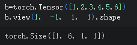   


<div style="break-after: page; page-break-after: always;"></div> 

## FeedForward Network  
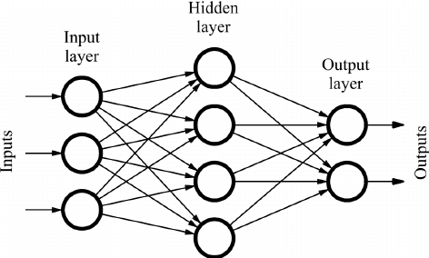  

```py
class FFN(nn.Module):
    def __init__(self, d_model = 512, d_ff=2048, dropout = 0.1):
        super().__init__()
        # We set d_ff as a default to 2048
        self.linear_1 = nn.Linear(d_model, d_ff)
        self.dropout = nn.Dropout(dropout)
        self.linear_2 = nn.Linear(d_ff, d_model)
    def forward(self, x):
        x = self.dropout(function.relu(self.linear_1(x)))
        x = self.linear_2(x)
        return x
```
```
個人想法:
FeedForward Network 是在深度學習中很常看到的類神經網路,
是由神經元及權重組合而成的全連接網路架構,
權重的設計對於整個網路的運算是重要的,
好的設計能使網路再訓練時達到良好的特徵抽取效果,
基於這點上,FeedForward Network 也使用 Dropout, 
來達成增強特徵及模擬實際情況的用意
```

<div style="break-after: page; page-break-after: always;"></div> 

## Normalization & add  
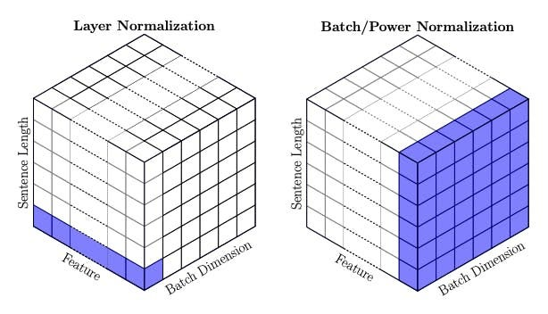   

$$LayerNorm(v) = \gamma \frac{v-\mu}{\sigma}+\beta$$
$\mu = \frac{1}{d}\sum_{k=1}^{d} v_{k}$
$\sigma^{2} = \frac{1}{d}\sum_{k=1}^{d} (v_{k}-\mu)^{2}$  

```py
class Normalization(nn.Module):
    def __init__(self, d_model = 512, eps = 1e-6):
        super().__init__()
    
        self.size = d_model
        self.alpha = nn.Parameter(torch.ones(self.size))
        self.bias = nn.Parameter(torch.zeros(self.size))
        self.eps = eps
    def forward(self, x):
        # x.mean(dim=-1, keepdim=True): keepdim=True 讓表現出來的維度不改變
        norm = self.alpha * (x - x.mean(dim=-1, keepdim=True)) / x.std(dim=-1, keepdim=True) + self.bias
        return norm
```
```
我的想法:
Normalization & add 是每個 (sublayer) 都包含的
函式,幫助輸出到下一子層的值部會出現極端值導致模型訓練上出現判斷的錯誤(訓練疲乏)，確保每個子層的輸入能夠得到較好的信息

```  

<div style="break-after: page; page-break-after: always;"></div> 

- 每個子層 (Sublayer) 的輸出  
    $$LayerNorm(x + Sublayer(x))$$

- torch.mean()  
    ```py
    x = torch.Tensor([1, 2, 3, 4, 5, 6]).view(2, 3, 1)
    y = torch.mean(x, dim=0)
    z = torch.mean(x, dim=2)
    h = torch.mean(x, dim=2, keepdim=True)
    print(x)
    print(y)
    print(z)
    print(h)
    ```
    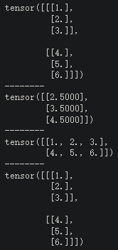
- torch.std()    
    ```py
    import torch

    x = torch.Tensor([1, 2, 3, 4, 5, 6]).view(2, 3, 1)
    y = x.std(dim=0, keepdim=True)
    z = x.std(dim=0)

    print(x)
    print("--------")
    print(y)
    print("--------")
    print(z)
    ```  
    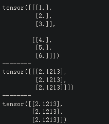  

<div style="break-after: page; page-break-after: always;"></div> 

## Encoder layer  
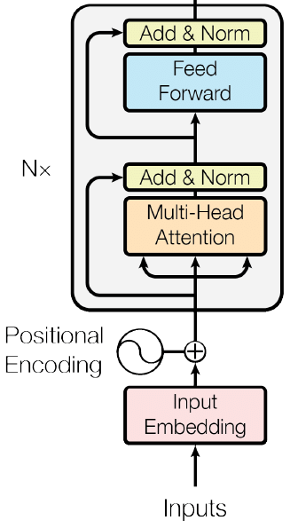  

```py
class EncoderLayer(nn.Module):
def __init__(self, d_model = 512, heads = 8, dropout = 0.1):
    super().__init__()
    self.norm1 = Normalization(d_model)
    self.norm2 = Normalization(d_model)
    self.attention = MultiHeadAttention(heads, d_model)
    self.FFN = FFN(d_model)
    self.dropout1 = nn.Dropout(dropout)
    self.dropout2 = nn.Dropout(dropout)
    
def forward(self, PE_tensor, mask):
    norm1_output = self.norm1(PE_tensor)
    Sublayer_1 = PE_tensor + self.dropout1(self.attention(norm1_output,norm1_output,norm1_output,mask))
    norm2_output = self.norm2(Sublayer_1)
    Sublayer_2 = Sublayer_1 + self.dropout2(self.FFN(norm2_output))
    return Sublayer_2
```  
```
建構 Encoder layer:
再 Transformer 中，每個子層都會通過 (Normalization) + 
```  

<div style="break-after: page; page-break-after: always;"></div> 

## Decoder layer  
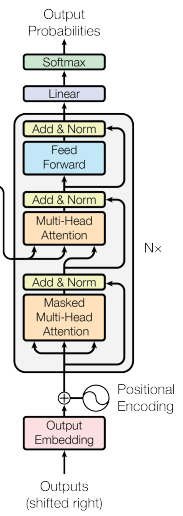  

```py
class DecoderLayer(nn.Module):
def __init__(self, d_model=512, heads=8, dropout=0.3):
    super().__init__()
    self.norm1 = Normalization(d_model)
    self.norm2 = Normalization(d_model)
    self.norm3 = Normalization(d_model)
    
    self.dropout1 = nn.Dropout(dropout)
    self.dropout2 = nn.Dropout(dropout)
    self.dropout3 = nn.Dropout(dropout)
    
    self.attention1 = MultiHeadAttention(heads, d_model)
    self.attention2 = MultiHeadAttention(heads, d_model)
    self.FFN = FFN(d_model).cuda()

def forward(self, PE_tensor, encoder_outputs, source_mask, target_mask):
    Mask_MultiHeadAtten_output = self.dropout1(self.attention1(PE_tensor, PE_tensor, PE_tensor, target_mask))
    layernorm1 = self.norm1(PE_tensor+Mask_MultiHeadAtten_output)
    MultiHeadAtten_output = self.dropout2(self.attention2(layernorm1, encoder_outputs, encoder_outputs, source_mask))
    layernorm2 = self.norm2(MultiHeadAtten_output+layernorm1)
    FFN_output = self.dropout3(self.FFN(layernorm2))
    layernorm3 = self.norm3(FFN_output+layernorm2)
    return layernorm3
```
```
建構 Decoder layer
```  

<div style="break-after: page; page-break-after: always;"></div> 

## 總結 
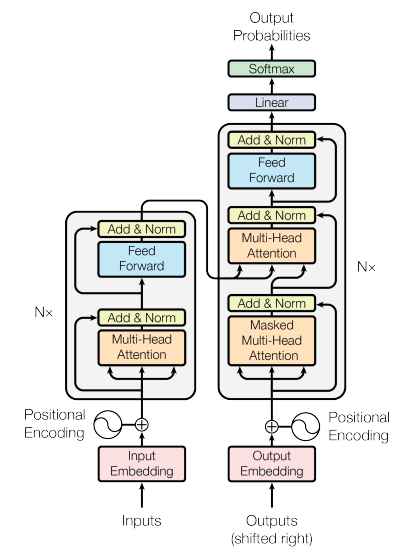  

```py
# 克隆 N 個模組,建立多層網路
def get_clones(module, N=6):
    return nn.ModuleList([copy.deepcopy(module) for i in range(N)]) 

class Encoder(nn.Module):
    def __init__(self, vocab_size, d_model=512, N=6, heads=8):
        super().__init__()
        self.N = N
        self.embed = Embedding(vocab_size, d_model)
        self.pe = PositionalEncoder(d_model)
        self.layers = get_clones(EncoderLayer(d_model, heads), N)
        self.norm = Normalization(d_model)
    def forward(self, source, mask):
        x = self.embed(source)
        x = self.pe(x)
        for i in range(self.N):
            x = self.layers[i](x, mask)
        return self.norm(x)
    
class Decoder(nn.Module):
    def __init__(self, vocab_size, d_model=512, N=6, heads=8):
        super().__init__()
        self.N = N
        self.embed = Embedding(vocab_size, d_model)
        self.pe = PositionalEncoder(d_model)
        self.layers = get_clones(DecoderLayer(d_model, heads), N)
        self.norm = Normalization(d_model)
    def forward(self, target, encoder_outputs, source_mask, target_mask):
        x = self.embed(target)
        x = self.pe(x)
        for i in range(self.N):
            x = self.layers[i](x, encoder_outputs, source_mask, target_mask)
        return self.norm(x)

class Transformer(nn.Module):
    def __init__(self, source_vocab, target_vocab, d_model=512, N=6, heads=8):
        super().__init__()
        self.encoder = Encoder(source_vocab, d_model, N, heads)
        self.decoder = Decoder(target_vocab, d_model, N, heads)
        self.out = nn.Linear(d_model, target_vocab)
    def forward(self, source_vocab, target_vocab, source_mask, target_mask):
        encoder_outputs = self.encoder(source_vocab, source_mask)
        decoder_output = self.decoder(target_vocab, encoder_outputs, source_mask, target_mask)
        output = self.out(decoder_output)
        return output
```
```  
我的想法:
Transformer 是 Encoder-Decoder Model,
與 Encoder-only 和 Decoder-only 是 3 種不同的模型,
Encoder-Decoder Model:使用再輸出依賴於輸入的內容，可用於(摘要內容、翻譯文本)
Encoder-only Model:處理分類任務，用於(命名實體識別)
Decoder-only Model:為3種模型中表現最全面的模型,也是目前生成式語言模型中最重要的模型架構，用於(文字摘要、翻譯、問答、分類等...)
```  
- 語言模型分布  
    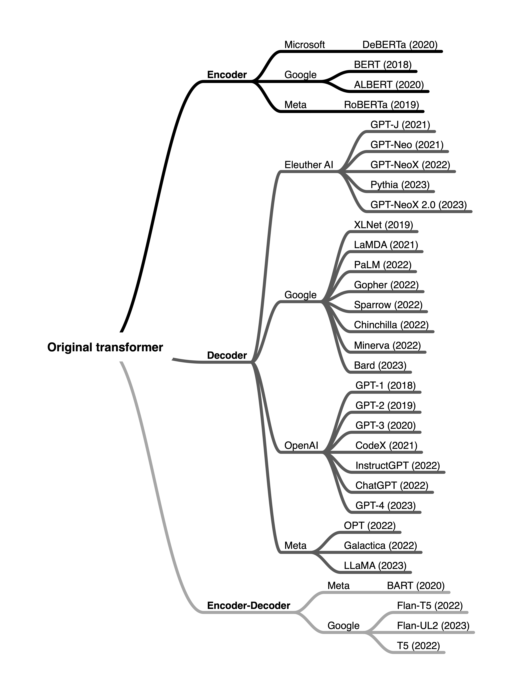  

<div style="break-after: page; page-break-after: always;"></div> 

# Cross Attention
```
依賴版本:
torch==2.3.1
python==3.10.12
```  

```py
import torch.nn as nn
import torch
import math

punctuation="，。、[],.!"
temp_str = str() 
ids = {}
tokens = []

input_sentence_1 = input("輸入中文句子: ")
input_sentence_2 = input("輸入英文句子: ")

# 定義 cross-attention
"""
參數定義:
query: (input*dim_keyorquery)(因為 key = query) of vector
key: (input*dim_keyorquery)(因為 key = query) of vector
value: (input*dim_value) of vector
"""
class Cross_Attention(nn.Module):
    def __init__(self, dim_input, dim_KorQ, dim_V):
        super().__init__()
        self.dim_KorQ=dim_KorQ
        self.Weight_Q=nn.Parameter(torch.rand(dim_input, dim_KorQ))
        self.Weight_K=nn.Parameter(torch.rand(dim_input, dim_KorQ))
        self.Weight_V=nn.Parameter(torch.rand(dim_input, dim_V))
    
    def forward(self,input_1,input_2):
        input1_Q=input_1.matmul(self.Weight_Q)
        input2_K=input_2.matmul(self.Weight_K)
        input2_V=input_2.matmul(self.Weight_V)
        
        #根號運算
        #sqrt_k = math.sqrt(self.dim_KorQ)

        #Cross_Attention
        A=torch.softmax(input1_Q.matmul(input2_K.T), dim=-1)
        
        Cross_Attention=A.matmul(input2_V)
        return Cross_Attention

# 前處理輸入 (ids and token)
def Embedding_input(sentence:str, temp_str:str):
    for i in punctuation: 
        inputs = sentence.replace(i,'')

    for line in inputs: 
        temp_str+=line 

    for i,s in enumerate(str(temp_str)):
        sorts = {s:i}
        ids.update(sorts)

    for s in temp_str:  
        tokens.append(ids[s])
    

    input_tokens=torch.tensor(tokens)
    #100 tensors of size 80
    embedding=torch.nn.Embedding(100, 100)
    #產生embedding vector, detach() 防止反向傳播(Backpropagation)
    embedded_sentence=embedding(input_tokens).detach()
    return embedded_sentence

# 前處理輸入2 (ids and token)
def Embedding_input2(sentence:str, temp_str:str, dim_input:int):
    for i in punctuation: 
        inputs = sentence.replace(i,'')

    for line in inputs: 
        temp_str+=line 

    for i,s in enumerate(str(temp_str)):
        sorts = {s:i}
        ids.update(sorts)

    for s in temp_str:  
        tokens.append(ids[s])
    

    input_tokens=torch.tensor(tokens)
    #100 tensors of size 80
    embedding2=torch.nn.Embedding(70, dim_input)
    #產生embedding vector, detach() 防止反向傳播(Backpropagation)
    embedded_sentence=embedding2(input_tokens).detach()
    return embedded_sentence
```  

<div style="break-after: page; page-break-after: always;"></div> 

# Self RAG + Graph RAG
```
依賴版本:
torch == 2.3.1
python == 3.10.12
langchain == 0.2.6
langchain-chroma == 0.1.2
langgraph == 0.1.9
```  

## 定義變數
```py
import os

os.environ["TF_CPP_MIN_LOG_LEVEL"] = "2"
from langchain_community.document_loaders import PyMuPDFLoader
from langchain.text_splitter import RecursiveCharacterTextSplitter
from langchain_huggingface.embeddings.huggingface import HuggingFaceEmbeddings
from langchain.memory import ConversationBufferMemory
from langchain.chains import ConversationalRetrievalChain

from langchain_community.llms import Ollama


from langchain_chroma import Chroma
from langchain.chains import LLMChain
from langchain_core.prompts import PromptTemplate
from langchain_core.output_parsers import StrOutputParser
from langchain_core.runnables import RunnablePassthrough


from langchain_core.prompts import ChatPromptTemplate
from langchain_core.pydantic_v1 import BaseModel, Field
from typing_extensions import TypedDict
from typing import List
from langgraph.graph import END, StateGraph
from src.RAG import RAG_PATH, SAVE_CHAT_DB_FOLDER

# 啟動 ollama
# local-llama3
# taide-TW-chat
# willh/taide-lx-7b-chat-4bit
llm = Ollama(model="willh/taide-lx-7b-chat-4bit", base_url="http://localhost:11434/")

# embedding
# https://huggingface.co/models?library=sentence-transformers
embed_model = HuggingFaceEmbeddings(model_name="BAAI/bge-large-zh-v1.5")


# PDF Data preprocess
loader = PyMuPDFLoader(str(RAG_PATH / "Data.pdf"))
PDF_data = loader.load()

# text_splitter
text_splitter = RecursiveCharacterTextSplitter(chunk_size=10000, chunk_overlap=500)
all_splits = text_splitter.split_documents(PDF_data)

# load vectordb
db = Chroma.from_documents(documents=all_splits, embedding=embed_model)

# retrieve
retriever = db.as_retriever()

```

<div style="break-after: page; page-break-after: always;"></div> 

## 架設模型
```py
class filesearch(BaseModel):
    """
    查詢提供的文件
    """

    # Pydantic: Field()-> 詳細的說明，用於資料驗證
    query: str = Field(description="搜尋相關文件")


# RAG Model
def RAGModel():
    instruction = """
        你是一位專業銷售員，請利用提取出來的文件內容來回應問題。
        若問題的答案無法從文件內取得，直接回覆不知道，禁止虛構答案。
        答案已準確回答為主。
        注意：請確保答案的準確性，不要自問自答。
    """
    # 儲存歷史對話紀錄
    # memory = ConversationBufferMemory(memory_key="chat_history", return_messages=True)

    # RAG Model
    # structured_llm_router = llm.bind_tools(tools=[web_search, vectorstore])

    """
    RAG_model = ConversationalRetrievalChain.from_llm(
        llm=llm, retriever=retriever, memory=memory
    )
     """

    prompt = ChatPromptTemplate.from_messages(
    [
        ("system",instruction),
        ("system","文件: \n\n {retriever}"),
        ("human","問題: {question}"),
    ]
    )

    """
    rag_chain = (
    {"context": retriever, "question": RunnablePassthrough()}
    | prompt
    | llm
    | StrOutputParser()
    )
    """

    rag_chain = prompt | llm | StrOutputParser()

    return rag_chain


# LLM Model
def LLM():
    # 輸出格式
    template = """
    你是負責處理使用者問題的助手，請利用你的知識來回應問題，
    不要虛構答案，用中文回答問題。  
    {chat_history}
    Human: {human_input}
    AI:
    """

    prompt = PromptTemplate(
        input_variables=["chat_history", "human_input"], template=template
    )

    # 儲存歷史對話紀錄
    memory = ConversationBufferMemory(memory_key="chat_history", return_messages=True)

    # 套用語言模型與輸出格式
    llm_chain = LLMChain(llm=llm, prompt=prompt, memory=memory)
    return llm_chain


# LLM Chat
def USELLM(chatname: str, model, question: str) -> None:
    save_chat_folder = SAVE_CHAT_DB_FOLDER / "chat_{}".format(chatname)
    save_chat_folder.mkdir(exist_ok=True, parents=True)
    save_chat_path = save_chat_folder / "chat_LLM.txt"
    # touch(exist_ok=True) 也能運作，但它會改變檔案的變更時間
    if (not save_chat_path.exists()) or (not save_chat_path.is_file()):
        save_chat_path.touch()
    # 讀取歷史對話
    with save_chat_path.open("r", encoding="utf-8") as chat_history:
        # 歷史對話
        history_question = "{}\n Human:{}\n".format(
            "".join(chat_history), "".join(question)
        )
    with save_chat_path.open("a", encoding="utf-8") as chats_file:
        # print("語言模型聊天， CTRL + Z 以退出(或輸入結束)")

        result = model.predict(human_input=history_question)
        # print("回答:" + "".join(result))
        chats_file.write(
            "Human:{} \nAI: {}\n".format("".join(question), "".join(result))
        )
    return result
```

<div style="break-after: page; page-break-after: always;"></div> 

## 定義 Self-RAG
```py
class IsREL(BaseModel):
    """
    確認提取文章與問題是否有關(相關 or 不相關)
    """

    # Pydantic: Field()-> 詳細的說明，用於資料驗證
    binary_score: str = Field(
        description="請問文章與問題是否相關。('相關' or '不相關')"
    )


def Retrieval_demand():
    instruction = """
                    你是一個評分人員，負責評估文件內容與問題的關聯性。
                    輸出'相關' or '不相關'
                    """
    Retrieval_prompt = ChatPromptTemplate.from_messages(
        [
            ("system", instruction),
            ("human", "文件內容: \n\n {document} \n\n 問題: {question}"),
        ]
    )

    Retrieval_prompt = Retrieval_prompt | llm

    # Grader LLM
    llm_grader = llm.with_structured_output(IsREL)

    # 使用 LCEL 語法建立 chain
    retrieval_demand = Retrieval_prompt | llm_grader
    return retrieval_demand


# 判斷語言模型生成的答案是否有幻覺(有沒有事實能佐證)
class IsSUP(BaseModel):
    """
    確認答案是否為虛構('虛構的' or '基於文件內容得出' or '一半虛構一半由文件得出')
    """

    binary_score: str = Field(
        description="答案是否由為虛構。('生成的答案是虛構的' or '生成的答案是是基於文件內容得出')"  # noqa: E501
    )


def supported():
    instruction = """
    你是一個評分的人員，負責確認LLM生成的答案是否為虛構的。
    以下會給你一個文件與相對應的LLM生成的答案，
    請輸出 '生成的答案是虛構的' or '生成的答案是是基於文件內容得出'做為判斷結果。
    """
    supported_prompt = ChatPromptTemplate.from_messages(
        [
            ("system", instruction),
            ("human", "取用文件: \n\n {documents} \n\n 回答: {generation}"),
        ]
    )

    supported_prompt = supported_prompt | llm

    llm_grader = llm.with_structured_output(IsSUP)

    # 使用 LCEL 語法建立 chain
    supported_grader = supported_prompt | llm_grader
    return supported_grader


# 判斷語言模型生成的答案是否可以正確回答使用者的問題
class IsUSE(BaseModel):
    """
    確認答案是否可以正確回答使用者的問題
    """

    # Pydantic: Field()-> 詳細的說明，用於資料驗證
    binary_score: str = Field(
        description="是否可以正確回答使用者的問題。('有回應到問題' or '沒有回應到問題')"
    )


def response():
    instruction = """
                你是一個評分人員，確認回答的答案是否回應問題，
                輸出 '有回應到問題' or '沒有回應到問題'。
                """
    response_prompt = ChatPromptTemplate.from_messages(
        [
            ("system", instruction),
            ("human", "問題: \n\n {question} \n\n 答案: {generation}"),
        ]
    )

    response_prompt = response_prompt | llm
    llm_grader = llm.with_structured_output(IsUSE)

    # 使用 LCEL 語法建立 chain
    response_grader = response_prompt | llm_grader
    return response_grader
```

<div style="break-after: page; page-break-after: always;"></div> 

```py
# Graph_RAG 設定
class GraphState(TypedDict):
    question: str
    generation: str
    documents: List[str]


# retrieve
def retrieve(state):
    question = state["question"]

    # Retrieval
    documents = retriever.invoke(question)

    return {"documents": documents, "question": question}


# 判斷問題是否與文件有關
def retrieval_demand(state):
    documents = state["documents"]
    question = state["question"]

    filtered_docs = []
    retrieval_gra = Retrieval_demand()

    for d in documents:
        score = retrieval_gra.invoke({"question": question, "document": d.page_content})
        grade = score.binary_score
        if grade == "yes":
            filtered_docs.append(d)
        else:
            continue
    return {"documents": filtered_docs, "question": question}


# RAG
def rag(state):
    question = state["question"]
    # documents = state["documents"]

    rag_chain = RAGModel()

    # RAG
    # generation = rag_chain.invoke({"question": question})
    # generation = rag_chain.invoke(question)
    generation = rag_chain.invoke({"retriever": retriever, "question": question})
    return {"question": question, "generation": generation}


# LLM
def answer(state):
    question = state["question"]
    llm_chain = LLM()

    # LLM
    generation = llm_chain.predict(human_input=question)
    return {"question": question, "generation": generation}
```

<div style="break-after: page; page-break-after: always;"></div> 

``` py
# 針對Graph State中的內容進行判斷決定流程後續進入到哪個Node中
def route_question(state):
    question = state["question"]
    RAG = RAGModel()

    #source = RAG.invoke({"question": question})
    source = RAG.invoke({"retriever": retriever, "question": question})
    #source = RAG.invoke({"documents": retriever, "question": question})

    
    if "tool_calls" not in source:
        return "answer"
    if len(source["tool_calls"]) == 0:
        raise Exception("Router could not decide source")

    datasource = source["tool_calls"][0]["function"]["name"]
    if datasource == "web_search":
        return "web_search"
    elif datasource == "filesearch":
        return "filesearch"


def route_retrieval(state):
    filtered_documents = state["documents"]

    if not filtered_documents:
        return "web_search"
    else:
        return "rag"


def grade_rag_generation(state):
    question = state["question"]
    documents = state["documents"]
    generation = state["generation"]

    hallucination_grader = supported()

    score = hallucination_grader.invoke(
        {"documents": documents, "generation": generation}
    )
    grade = score.binary_score

    answer_grader = response()

    # 確認有無幻覺
    if grade == "no":
        # 檢查答案符不符合問題
        score = answer_grader.invoke({"question": question, "generation": generation})
        grade = score.binary_score
        if grade == "yes":
            return "useful"
        else:
            return "not useful"
    else:
        return "not supported"
```

<div style="break-after: page; page-break-after: always;"></div> 

## 使用 Self-RAG
```py
# Graph_RAG
workflow = StateGraph(GraphState)

# Define the nodes
workflow.add_node("retrieve", retrieve)  # retrieve
workflow.add_node("retrieval_demand", retrieval_demand)  # retrieval demand
workflow.add_node("rag", rag)  # rag
workflow.add_node("answer", answer)  # llm

# 建構
workflow.set_conditional_entry_point(
    route_question,
    {
        "filesearch": "retrieve",
        "answer": "answer",
    },
)
workflow.add_edge("retrieve", "retrieval_demand")
workflow.add_conditional_edges(
    "retrieval_demand",
    route_retrieval,
    {
        "rag": "rag",
    },
)
workflow.add_conditional_edges(
    "rag",
    grade_rag_generation,
    {
        "not supported": "rag",
        "useful": END,
    },
)
workflow.add_edge("answer", END)
```

<div style="break-after: page; page-break-after: always;"></div> 

```py
# Compile
app = workflow.compile()


# Graph_RAG(內含 Self_RAG)
def Graph_and_Self_RAG(question: str, chat_name: str) -> str | None:
    chat_name = chat_name.strip()
    if chat_name != "":
        save_chat_folder = SAVE_CHAT_DB_FOLDER / f"chat_{chat_name}"
        save_chat_folder.mkdir(parents=True, exist_ok=True)
        save_chat_path = save_chat_folder / "chat_RAG.txt"
        # touch(exist_ok=True) 也能運作，但它會改變檔案的變更時間
        if (not save_chat_path.exists()) or (not save_chat_path.is_file()):
            save_chat_path.touch()  # Create empty file

        # 讀取歷史對話
        if save_chat_path.exists():
            with save_chat_path.open(mode="r", encoding="utf-8") as chat_history_RAG:
                # 歷史對話
                history_chat = "{}\n{}\n".format(
                    "".join(chat_history_RAG), "".join(question)
                )
        if save_chat_path.exists():
            with save_chat_path.open(mode="a", encoding="utf-8") as RAG_chats_file:
                inputs = {"question": history_chat}
                # 取出最後一筆輸出作為output
                for output in app.stream(inputs):
                    pass

                if "rag" in output.keys():
                    RAG_chats_file.write(
                        "問題:{}\n回答:{}\n".format(
                            "".join(question),
                            "".join(output["rag"]["generation"]),
                        )
                    )
                    return output["rag"]["generation"]
                elif "answer" in output.keys():
                    RAG_chats_file.write(
                        "問題:{}\n回答:{}\n".format(
                            "".join(question),
                            "".join(output["answer"]["generation"]),
                        )
                    )
                    return output["answer"]["generation"]
```