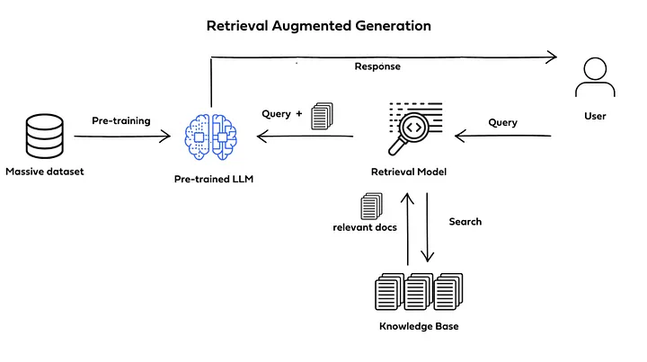
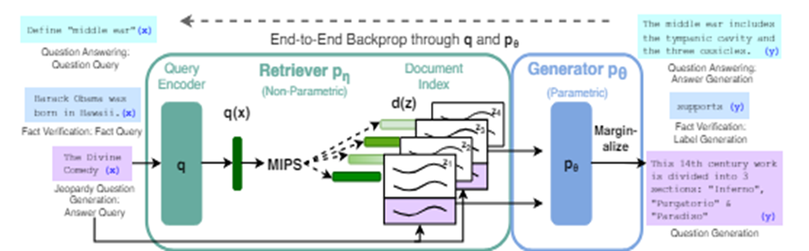
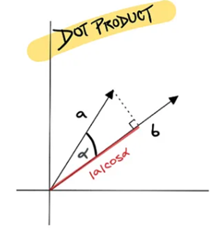

# RAG 
  

## 簡介
```
RAG (Retrieval-Augmented Generation) 是將檢索器與生成器結合起來訓練的模型，透過檢索器可以將外部知識(非記憶參數) 傳輸給生成器(語言模型) 進行邏輯推理
簡單來說，RAG 是不需要經過訓練就能擴充記憶的模型，這會給語言模型帶來很多方便，但不可改變的是語言模型本身的推理邏輯(不同的模型會因為訓練過程不同而導致回答邏輯有些不同)

名詞解釋:
記憶參數: 語言模型訓練時所吸收到的資料(訓練完後固定)
非記憶參數: 語言模型沒有訓練過的資料(不固定，隨著給定的資料更迭)
```  
## 模型架構  
  

<div style="break-after: page; page-break-after: always;"></div> 

### Retriever  
#### Non-parametric memory  
```
非記憶參數: 不用經由訓練就能使用
RAG 會被廣泛使用的重點原因，可以在不用預先訓練的情況下擴充語言模型原有的知識庫(擴充的知識是暫存的)
檢索器可以讓外部知識更好的相容於生成器(語言模型)
```  
- MIPS(Maximum Inner Product Search)  
      

    $$z = \underset{x \in S}{arg max} x^{\top} q$$

    ```
    MIPS(最大化內積搜索):  
    定義: 即在一個向量集合 S 中，找出一個與查詢向量 q 內積最大的向量 z 

    MIPS(最大化內積搜索) 顧名思義是利用內積來進行搜索, 在 RAG 中會先由檢索器檢索出 (與問題相關的 top-k 個文字序列), 再從挑選出來(top-k)文字序列中, 利用 MIPS 檢索出最相符合的一個文字序列推送給生成器。 
    ```

#### Generator  
- Parametric memory  
    ```
    記憶參數: 經由訓練將知識儲存在生成器(語言模型)
    生成器可以當成是語言模型(Decoder-only 居多)，透過語言模型強大的推理及生成能力，讓 RAG 能解決更多問題(問答任務)，更有趣的是，每個語言模型所生成出來的內容都會不同(給定的知識相同)，這會讓 RAG 有更多元的表現
    ```

<div style="break-after: page; page-break-after: always;"></div> 

## 模型類型  
### RAG-Sequence Model  
#### 公式  

  

- Neural Knowledge Retriever(檢索器)  
    $$\boldsymbol{p}_{\eta}(z|x)$$  
    ```
    檢索器:
    負責檢索出與問題相關的序列，並傳輸給生成器進行邏輯處理並輸出
    ```
- Knowledge augmented Classifier(知識分類器)  
    $$\boldsymbol{p}_{\theta}(y|x,z)$$  
    ```
    知識分類器:
    作用與生成器相同,將檢索器檢索完的知識進行邏輯推理，得出最好的結果
    補充:
    生成器會考慮自身的記憶邏輯，以人來說就是已知的知識
    ```

<div style="break-after: page; page-break-after: always;"></div> 

### RAG-Token Model  
#### 公式  

  

- Neural Knowledge Retriever(檢索器)  
    $$\boldsymbol{p}_{\eta}(z|x)$$  
    ```
    檢索器:
    負責檢索出與問題相關的序列，並傳輸給生成器進行邏輯處理並輸出

    與 RAG-Sequence Model 不同的點:
    RAG-Token Model 可以檢索多文件
    因為可以檢索多個文件，使得檢索器必須知道各個序列是否與問題有相關聯
    ```
- Knowledge augmented Classifier(知識分類器)  

      

    ```
    知識分類器:
    作用與生成器相同,將檢索器檢索完的知識進行邏輯推理，得出最好的結果

    補充:
    生成器會考慮自身的記憶邏輯，以人來說就是已知的知識

    與 RAG-Sequence Model 不同的點:
    需要吸收來自不同文件的資訊，會讓生成器所產生的內容更加廣泛且更加嚴謹
    ```  

<script type="text/javascript" src="http://cdn.mathjax.org/mathjax/latest/MathJax.js?config=TeX-AMS-MML_HTMLorMML"></script>
<script type="text/x-mathjax-config"> 
MathJax.Hub.Config({ tex2jax: {inlineMath: [['$', '$']]}, messageStyle: "none" });
</script>