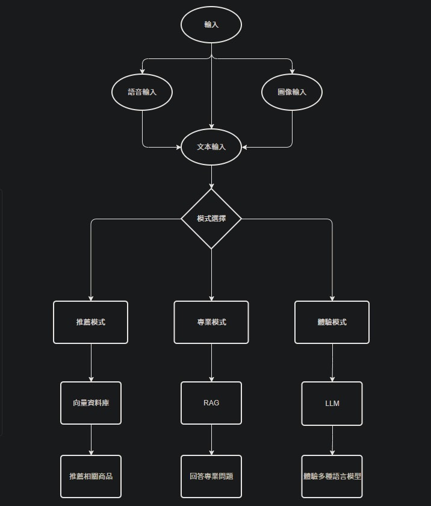

# Syzygy(人類的朋友)
  

## 目錄
- [Syzygy(人類的朋友)](#syzygy人類的朋友)  
    - [目錄](#目錄)  
    - [介紹](#介紹)  
        - [主題](#主題)  
        - [功能](#功能)  
        - [使用情境](#使用情境)  
    - [架構圖](#架構圖)  
- [技術理論(目錄)](#技術理論目錄)  
- [技術理論](#技術理論)  
    - [LLM(Large Language Model)](#llmlarge-language-model)  
    - [RAG(Retrieval-Augmented Generation)](#rag-retrieval-augmented-generation)  
    - [Self RAG](#self-rag)  
    - [Graph RAG](#graph-rag)  
    - [YOLO](#yolo)  
    - [YOLO v8](#yolo-v8)  
    - [Whisper](#whisper)  
- [理論實作](#理論實作)  
- [References](#references)  

<div style="break-after: page; page-break-after: always;"></div>  

## 介紹
這個專題的出發點是利用當今人工智慧的技術做整合來幫助某部分的人，讓真正需要被幫助的人能獲得良好的體驗，同時減輕某些職業的工作負擔與疲勞程度！  

### 主題  
出於幫助某部分的人這點，製作此專題時，則需要限縮範圍，才能設計出更貼近要求的工具。  

- 主題
    - 以銷售員為主要出發點出發來幫助需求者  
    - 擁有基本的辨識能力  
    - 利用生成式人工智慧來實作此專題  

### 功能  
- 互動式對話
    - Retrieval Augmented Generation(RAG):  
    使用文本讓語言模型回答更嚴謹、更符合事實。  
    - LLM(Large Language Model):
    讓使用者體驗不同的大語言模型(Decoder-only)

- 影像辨識
    - YOLO v8:  
    [Github](<https://github.com/ultralytics/ultralytics> "github") 
- 語音辨識
    - Whisper:  
    [Github](<https://github.com/openai/whisper> "github")  

<div style="break-after: page; page-break-after: always;"></div>

### 使用情境  
- 主題  
    ```
    解決消費者對於商品相關的問題並幫助銷售員(相關職務)，
    讓銷售員能夠利用生成式AI來幫助自身的工作體驗更加提升
    ```  
    - 解決問題  
        - 消費者對於商品的疑問  
        - 幫忙負擔銷售員的工作  
        - 讓大眾熟悉 AI  
    - 任務  
        - 幫忙銷售員回答商品相關問題  
        - 整理各種資料減輕職務負擔  
        - 加入銷售與消費相關法案，讓民眾更了解法律，不觸法  
    - 情境  
        - 各大商場及賣場  
        - 批發商與雜貨店  
        - 便利店(超商)  
        - 經銷商  
        - 團購大盤商  
        - 需要金融交易的各大廠商與企業   

<div style="break-after: page; page-break-after: always;"></div>

- 使用須知:  
    - 專業模式:  
        - 輸入:  
            ```
            消費者相關問題
            ```
        - 輸出:  
            ```
            會以專業的角度仔細地回答消費者所提出的問題
            ```
    - 體驗模式:  
        - 輸入:  
            ```
            讓使用者能體驗語言模型(隨機提問)
            ```
        - 輸出:  
            ```
            會跟 GPT 或 Gemini 的輸出類似(無法保證真實性)
            ```
    - 全局功能:  
        - 語音辨識:  
            ```
            能辨識多國語言(內建多國翻譯中文)
            ```
        - 圖像辨識:  
            ```
            辨識商品圖像(辨識類別有限，僅辨識常見的商品)
            ```

<div style="break-after: page; page-break-after: always;"></div>

## 架構圖  
   

- 專業模式  
    - 幫助使用者解決消費相關問題。
- 體驗模式
    - 體驗與語言模型互動。  

<div style="break-after: page; page-break-after: always;"></div>

## 技術理論(目錄)  

- 生成式AI
    - Transformer:  
    由 Encoder 和 Decoder 並行處理的 (self-attention) 架構  
    - RAG:  
    改善語言模型回答不精確、不嚴謹的問題，讓語言模型可以應對更多的任務  
    - Self-RAG:  
    在基本的 RAG 架構上，以軟限制或硬控制(soft constraints or hard control)的方式，改善一般 RAG 的輸出(冗長、不精確、偏離事實)  
    - Graph-RAG:  
    將一般 RAG 的向量資料庫轉換成圖資料庫，讓 RAG 更能發現資料與問題的相關性  

- Image Recognition  
    - YOLO  

- Speech to Text  
    - Whisper  

<div style="break-after: page; page-break-after: always;"></div>

## 技術理論  
### LLM(Large Language Model)
[LLM](https://hackmd.io/fH1J6YPlTiixPQ_gXbdh-g)  
[[1], [2], [3]](#references)  

### RAG (Retrieval-Augmented Generation)  
[RAG](https://hackmd.io/@oA5KzG1CSmCA8y1YTihLtg/rJ5R8QyhC)  
[[4], [5], [6]](#references)  

### Self RAG
[Self RAG](https://hackmd.io/@oA5KzG1CSmCA8y1YTihLtg/BJ4kOXJhR)  
[[7]](#references)  

### Graph RAG
[Graph RAG](https://hackmd.io/I7b_RdTlTX2KFoB2PfbH6Q?view)  
[[8], [9]](#references)  

### YOLO
[YOLO](https://hackmd.io/@oA5KzG1CSmCA8y1YTihLtg/By860MyhC)  
[[10]](#references)  

### YOLO v8
[YOLO v8](https://hackmd.io/@oA5KzG1CSmCA8y1YTihLtg/SkTBgXJnA)  
[[11]](#references)  

### Whisper
[Whisper](https://hackmd.io/@oA5KzG1CSmCA8y1YTihLtg/S1Ti2zJ2C)  
[[12]](#references)  

## 理論實作
[Practical](https://hackmd.io/@oA5KzG1CSmCA8y1YTihLtg/HyoFKXk20)  

<div style="break-after: page; page-break-after: always;"></div>

## References
[1] Ashish Vaswani, Noam Shazeer, Niki Parmar, Jakob Uszkoreit, Llion Jones, Aidan N. Gomez, Łukasz Kaiser, and Illia Polosukhin. Attention Is All You Need. arXiv:1706.03762v7 [cs.CL] 2 Aug 2023  

[2] Mozhdeh Gheini, Xiang Ren, Jonathan May. Cross-Attention is All You Need: Adapting Pretrained Transformers for Machine Translation. arXiv:2104.08771v2 [cs.CL] 14 Sep 2021.  

[3] Generative Deep Learning Teaching Machines to Paint, Write, Compose, and Play. Second Edition.  

[4] Patrick Lewisyz, Ethan Perez, Aleksandra Piktusy, Fabio Petroniy, Vladimir Karpukhiny, Naman Goyaly, Heinrich Küttlery, Mike Lewisy, Wen-tau Yihy, Tim Rocktäschelyz, Sebastian Riedelyz, and Douwe Kiela. Retrieval-Augmented Generation for Knowledge-Intensive NLP Tasks. arXiv:2005.11401v4 [cs.CL] 12 Apr 2021  

[5] Sewon Miny, Patrick Lewis, Ledell Wu, Sergey Edunov, Danqi Chenz, and Wen-tau Yih. Dense Passage Retrieval for Open-Domain Question Answering. arXiv:2004.04906v3 [cs.CL] 30 Sep 2020.  

[6] Chenyu Zhao, Yunjiang Jiang, Yiming Qiu, Han Zhang, Wen-Yun Yang. Differentiable Retrieval Augmentation via Generative Language Modeling for E-commerce Query Intent Classification. arXiv:2308.09308v3 [cs.IR] 15 Sep 2023.  

[7] Akari Asai, ZeqiuWu, YizhongWang, Avirup Sil, Hannaneh Hajishirz. SELF-RAG: LEARNING TO RETRIEVE, GENERATE, AND CRITIQUE THROUGH SELF-REFLECTION. arXiv:2310.11511v1 [cs.CL] 17 Oct 2023.  

[8] Darren Edge1, Ha Trinh1, Newman Cheng, Joshua Bradley, Alex Chao, Apurva Mody, Steven Truitt, Jonathan Larson. From Local to Global: A Graph RAG Approach to Query-Focused Summarization. arXiv:2404.16130v1 [cs.CL] 24 Apr 2024.  

[9] Ciyuan Peng, Feng Xia, Mehdi Naseriparsa, Francesco Osborne. Knowledge Graphs: Opportunities and Challenges. arXiv:2303.13948 [cs.AI] Fri, 24 Mar 2023.  

[10] Joseph Redmon, Santosh Divvala, Ross Girshick, Ali Farhadi. You Only Look Once: Unified, Real-Time Object Detection. arXiv:1506.02640v5 [cs.CV] 9 May 2016.  

[11] Juan R. Terven, Diana M. Cordova-Esparza. A COMPREHENSIVE REVIEW OF YOLO ARCHITECTURES IN COMPUTER VISION: FROM YOLOV1 TO YOLOV8 AND YOLO-NAS. arXiv:2304.00501v7 [cs.CV] 4 Feb 2024.  

[12] Alec Radford, JongWook Kim, Tao Xu, Greg Brockman, Christine McLeavey, Ilya Sutskever. Robust Speech Recognition via Large-ScaleWeak Supervision. arXiv:2212.04356 [eess.AS] Tue, 6 Dec 2022.  

Mike Lewis, Yinhan Liu, Naman Goyal, Marjan Ghazvininejad, Abdelrahman Mohamed, Omer Levy, Ves Stoyanov, Luke Zettlemoyer. BART: Denoising Sequence-to-Sequence Pre-training for Natural Language Generation,Translation, and Comprehension. arXiv:1910.13461v1 [cs.CL] 29 Oct 2019.  


        