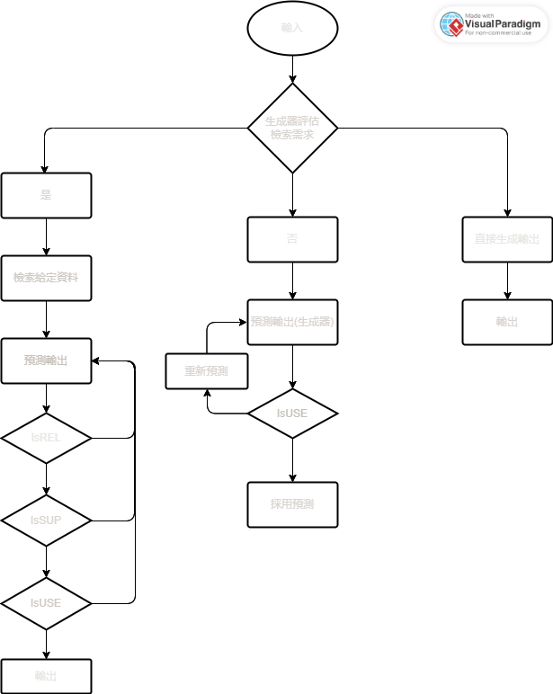

# Self RAG
## 簡介  
```
Self-RAG 是基本 RAG 的改良版，改善了 RAG 會遇到的問題！
RAG 的問題：
1.回答偏離主題且檢索出來的內容有時會過於冗長
2.不會理會輸入與輸出是否相關，導致輸出會產生與事實不相符合的問題
3.降低了語言模型的生成多樣性
4.無法保證輸入與檢索出的內容有無相關  

為了改善上述問題，就在 Self-RAG 中加入了反省機制，也是因為有了反省機制，讓輸出變得完整且多樣化！
```  
## 架構(推理流程)  
  
```
Self-RAG 整體是由3個模型組合而成的，各自有著不同的任務
3個模型分別為：
1.Retriever: 
負責檢索與輸入相關的段落

2.Generator LM:
根據輸入的內容預測輸出(需要檢索時，會參考給定的資料進行預測)

3.Critic model:
Self-RAG 新增的反省機制，可以阻止語言模型產生幻覺或是提高檢索器的檢索品質
```
### IsREL  
```
判斷檢索到的段落對於回答問題有沒有作用，附加 critique tokens
```  
- input: 問題、檢索到的段落  
- output: 有作用、沒作用  
- critique tokens: {有作用,沒作用}  

### IsSUP  
```
判斷預測輸出有沒有足夠的事實依據來支持(符不符合現實情況)，附加 critique tokens
```  
- input: 問題、檢索到的段落、預測的輸出  
- output: 充分支持、大部分支持、不支持  
- critique tokens: {充分支持,大部分支持,不支持}  

### IsUSE  
```
判斷語言模型預測的輸出回答問題的程度，
以數字表示(數字越大表示答案能解決問題的程度越高)，
附加 critique tokens
```  
- input: 問題、預測的輸出  
- output: 1~10(數字自訂，用來表示程度)  
- critique tokens: {1,2,3,4,5,6,7,8,9}  

## Critic Model
```
以語言模型為初始化的訓練依據，產生反省標記(reflection tokens)做為知識儲存

備註: 產生標記的品質會隨著語言模型而有所變動
作用: 用來幫助生成器評估段落的品質

細部程序:
第一步: 評估每個檢索段落是否與輸入相關(IsREL，附加 critique tokens)
第二步: 如果段落是相關的，評估能否支援生成器預測輸出(IsSUP，附加 critique tokens)
第三步: 評估預測的輸出回答問題的品質(IsUSE)
```
### reflection tokens 格式  
$$\left\{ X^{sample},Y^{sample} \right\}\sim \left\{ X,Y \right\}$$  
```
不同的(reflection tokens)組有不同的定義及輸入用來預測為文字，對於評估輸出有很大的幫助，資料越多，越接近於人類的評估
```  
#### 公式  
```
已知 I, x, y 的情況下，將(reflection tokens)預測為文字
I: 示範例子(少量)
x: 輸入(以當下情況為主)
y: 預測的輸出(每個語言模型所預測的輸出皆有些許差異)
```
$$p(r|I,x,y)$$  

### Critic Model(公式)  
```
以語言模型的基本建模理論為底，並最大化其可能(maximizing likelihood)
```  
$$\underset{\mathcal{C}}{max}\mathbb{E}_{((x,y),r)\sim D_{critic}}\text{log }p_{\mathcal{C}}(r|x,y)\text{, r for reflection tokens}$$  

## Generator Model
```
訓練資料:
Critic Model 執行完後的(reflection tokens) 和原本的輸入輸出
先使用 Critic Model 來幫助生成器的生成品質
訓練內容:
1.預測輸出
2.reflection tokens
```  
### 遮罩(Mask) 格式  
```
作用: 遮蔽檢索到的文字段落，計算損失值
格式: <p> 文字內容 <p>
```
### reflection tokens  
```
作用: 擴充詞彙表內容(知識擴充)
格式: {Critique, Retrieve} 
```
### 公式  
$$\underset{\mathcal{M}}{max}\mathbb{E}_{(x,y,r)\sim D_{gen}}\text{log }p_{\mathcal{M}}(y,r|x)$$

## Self-RAG 細談
```
Self-RAG 改善的成果:
1.讓檢索的次數增加，確保輸出與檢索出的內容能更與事實相符(能被客觀證據證明)
2.在 Open-domain 的情況下，會優先考慮創意及多樣性(減少檢索次數)
3.設定臨界值，讓檢索器中的所有標記都有參考依據(是否啟動檢索)，超過臨界值啟動；不超過則不啟動
4.新增了 critique tokens， 讓反省機制能更加成熟，
當需要檢索時， 會開始加入 critique tokens， 直到 IsUSE
5.在每個步驟加入評估分數，用(critic score S)來做迭代
6.加入(segment-level beam search)，讓(IsREL、IsSUP、IsUSE)經由分數評比(beam-search score)選出最好的段落
```
### segment score(單個段落分數)  
```
作用:
幫助反省機制的運行，增強 Critic Model 的效果
```  
$$f(y_{t},d,critique) = p(y_{t}|x,d,y_{\lt t})+S(critique)$$

#### critic score S  
```
每個 critique tokens 的分類，用歸一化概率的線性加權總和(linear weighted sum of the normalized probability) 
```  
$$S(critique)=\sum_{G\in\mathcal{G}}^{}w^{G}s^{G}_{t}\text{ for }\mathcal{G} = \left\{ IsREL,IsSUP,IsUSE \right\}$$  

- $s^{G}_{t}$  
    ```
    產生最理想 reflection tokens 的機率 
    ```  
    $$s^{G}_{t} = \frac{p_{t}(\widehat{r})}{\sum_{i=1}^{N^{G}}p_{t}(r_{i})}$$  

### beam-search score  
```
以標準化機率來計算(IsREL、IsSUP、IsUSE)的 beam-search score
```  
#### For IsREL  
$$s(IsREL)=\frac{p(IsREL=\text{有作用})}{p(IsREL=\text{有作用}) + p(IsREL=\text{沒有作用})}$$  

#### For IsSUP  
$$s(IsSUP)=\frac{p(IsSUP=充分支持)}{S}+\frac{p(IsSUP=大部分支持)}{S}\times 0.5+\frac{p(IsSUP=不支持)}{S}\times 0$$  
- S:  
    $$\sum_{t\in \left\{ 充分支持,大部分支持,不支持 \right\}}^{}p(IsSUP=t)$$  

#### For IsUSE  
```
給予加權並分配，讓分數階級更有差異性
```  

$$s(IsUSE)=\sum_{i}^{9}w_{i}\frac{p(IsUSE=i)}{S}$$  

- S:  

    $$\sum_{t\in \left\{ 1,2,3,4,5,6,7,8,9 \right\}}^{}p(IsUSE=t)$$  

- $w_{i}$:  

    $${\left\{ -2, -1.5, −1, −0.5, 0, 0.5, 1, 1.5, 2 \right\}}$$  
    
### adaptive retrieval(自適應檢索器)  
```
設定條件，讓檢索器能選擇開始檢索或停止檢索
```  
$$\frac{p(Retrieve=YES)}{p(Retrieve=YES)+p(Retrieve=NO)}\gt \delta$$  
