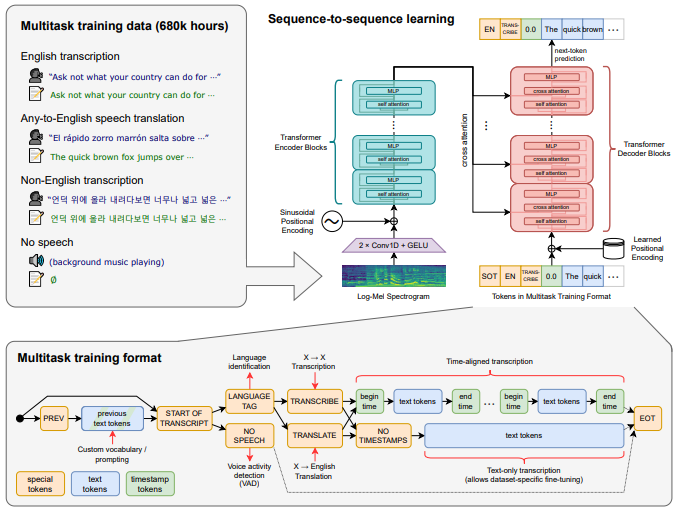
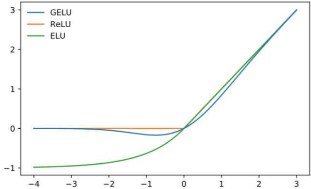
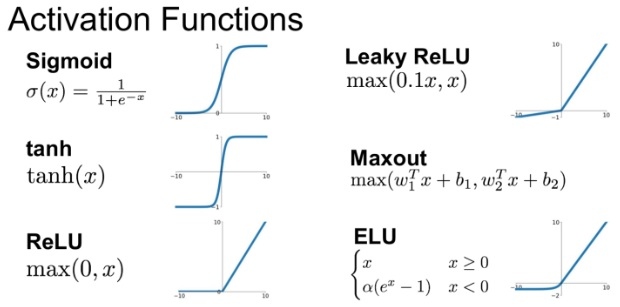

# Whisper
```
簡介: 1(音訊) 對 多(轉錄、翻譯、語言辨識) 模型
基礎模型: Encoder-Decoder Transformer
Input(音訊): 進行特徵縮放(將數值壓在 -1 ~ 1 之間) 
Output(文本): 解碼器輸出(文本)
```  
  

<div style="break-after: page; page-break-after: always;"></div> 

## 2 * Conv1D + GELU  
### GELU(Gaussian Error Linear Units)  
```
定義: 模擬自然神經元，結合線性及非線性激活函數，讓激活效果更好。

優點:
1.平滑性：
相較於ReLU及其變種，GELU函數在整個實數域上是連續且光滑的，這有助於在訓練過程中梯度更容易傳播，進而提高模型的訓練效率和收斂速度。

2.飽和度控制：
GELU在較大輸入時不會像sigmoid那樣飽和，也不會像ReLU那樣在大於0的區域產生恆定斜率，而是根據輸入值的大小提供不同的非線性程度。

3.減少過度擬合：
GELU的隨機性和對輸入分佈的適應性有助於減輕過度擬合現象，使得模型在處理複雜任務時表現更好。

缺點:
1.運算效率：
不是簡單的閾值函數，公式涉及誤差函數，導致計算相對複雜且耗時。

2.近似誤差：
在實際應用中，由於誤差函數的複雜性，通常會使用近似公式替代，導致精度損失。

3.初始化敏感性：
GELU相對於ReLU等函數可能對模型權重的初始值更為敏感，不當的初始化可能會導致訓練初期梯度消失或爆炸的問題。
```  

<div style="break-after: page; page-break-after: always;"></div> 

#### 激活函數比較  
```
GELU 擁有更好性能和收斂速度
```  
  

- 各種激活函數:  
      

<div style="break-after: page; page-break-after: always;"></div> 

#### 公式
```
輸入值較小，輸出較小的非線性響應；
輸入值增大，非線性響應逐漸增強，同時保持了負輸入區域的部分響應
```  
  

## Encoder Blocks  
```
多個小層(MLP + self attentoin)組成
```  
### MLP(Multilayer perceptron)  
內容在 MLP

### Self Attention  
內容在 LLM
      
## Decoder Blocks  
```
多層(self-attention + cross-attention + MLP)
```  
### MLP(Multilayer perceptron)  
內容在 MLP

### Self Attention  
內容在 LLM

### Cross Attention  
內容在 LLM


