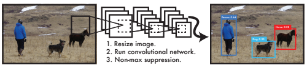
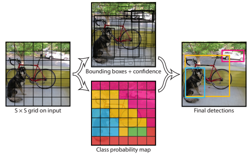
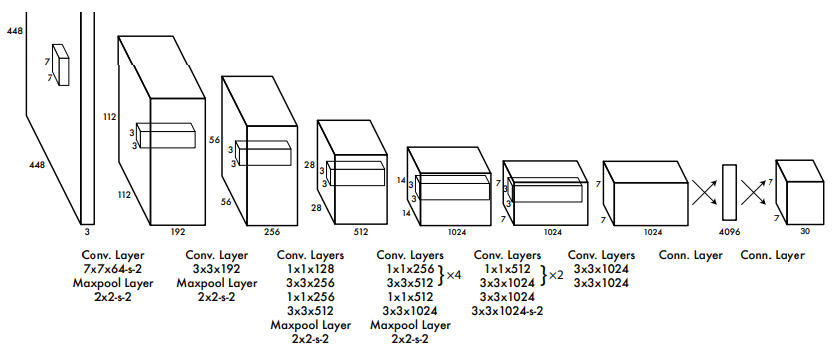
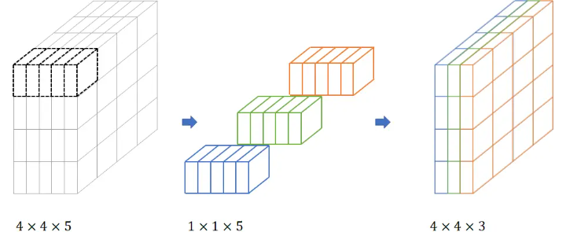
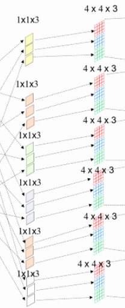
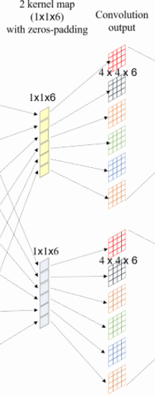
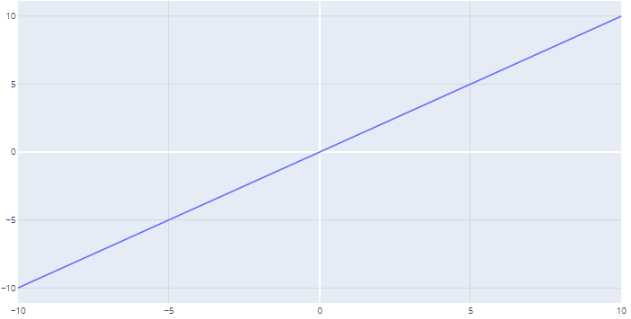

# YOLO
```
YOLO(物件偵測):
利用邊界框來區分不同物件，並給予每個物件各自的類別機率(偵測管道是單一網路，因此可以直接針對偵測效能進行端對端最佳化)

基本(物件偵測):
利用分類的概念進行物件偵測
```
## 簡介
```
YOLO 特性及優缺點: 
1. 可同時預測多個框起來的物件及(這些物件)的類別機率
2. 與基本圖像辨識不同，YOLO 將物件辨識定義成回歸問題
3. 在圖像上直接執行神經網路，就能預測出結果
4. 可以即時處理串流視訊，延遲時間少於 25 毫秒
5. 平均精確度是其他即時系統的兩倍以上
6. 預測時會對影像進行全局推理(訓練和測試時會觀測整個影像，因此會隱含地編碼類別的上下文資訊以及物件的外觀)
7. 與 Fast R-CNN 相比，YOLO 的背景錯誤次數不到其一半
8. 可學習物件的通用特徵(generalizable representations)
9. 具備高度概括性(應用在新領域或奇特的輸入時，較不容易發生故障)
10. 難以精確定位某些物件，尤其是小物件(前幾代 YOLO)
```
  


## Unified Detection
```
1.將物體偵測的獨立元件統一為單一的神經網路，直接識別整張圖像(將整張圖像內的物件分成多個類別框，並同時預測所有類別框)
2.YOLO 可實現端對端訓練和實時速度，同時維持高平均精確度
3.將輸入影像分割成 (N * N) 的 grid(多個)，依據物件的位置來進行預測(當物件落在 grid cell)，每個 (grid cell) 負責預測 邊界框及信心分數(B bounding boxes and confidence) 
4.信心分數代表模型對於 (邊界框內含的物件) 的信心程度，同時也代表模型認為它所預測的邊界框之準確程度(當邊界框內沒有物件，信心分數為 0 )
6.邊界框有5個預測元件: x, y, w, h, and confidence score
7.每個網格單元 (grid cell) 也會預測 C 個條件類別概率 (conditional class probabilities)，每個 (grid cell) 只會預測一組類別概率
8.特定類別信心分數 = 條件類別概率 * 個別方格的信心度
```

<div style="break-after: page; page-break-after: always;"></div> 

### 邊界框預測元件  
- (x,y):  
    ```
    x: 方格單元邊界的 x 座標(0~1之間)
    y: 方格單元邊界的 y 座標(0~1之間)
    ```
- (w,h):  
    ```
    w: 邊界框的寬度(0~1之間)
    h: 邊界框的高度(0~1之間)
    ```
- confidence(信心度):  
    ```
    預測方塊 (predicted box) 與地面真值 (ground truth) 之間的交集與結合 (intersection over union，IOU)
    ```
    $$Pr(Object) ∗ IOU^{truth}_{pred}$$  

### 特定類別信心分數:  
   

  

<div style="break-after: page; page-break-after: always;"></div> 

#### 預測張量 (predictions are encoded an tensor):  
$$ S * S * (B ∗ 5 + C) $$
- PASCAL VOC 上評估 YOLO:  
    ```
    S = 7、B = 2、C = 20(有 20 個標籤類別)
    ```
    - prediction tensor:  
        $$7 * 7 * 30$$  

##  Neural Network Design
```
參考 GoogLeNet model
```

  

### 組成:  
```
input: (224*224)的圖像解析度(原始的一半)，下一層為(448*448)的圖像解析度
convolutional layers * 24 + fully connected layers * 2
output:  7 × 7 × 30 tensor
```

<div style="break-after: page; page-break-after: always;"></div> 

### convolutional layers:  
```
作用:從影像中萃取特徵
YOLO 是使用 1*1 convolutional
```
#### 1*1 convolutional:  
```
作用: 降維 or 升維
```  
##### 簡化圖:  
```
input: 4*4*5 (降維)---> 1*1*5 (升維)---> output: 4*4*3 
```

  

##### 完整圖:  
```
input --> convolutional layers 1 --> convolutional layers 1 output --> convolutional layers 2 --> convolutional layers 2 output
```

  

###### convolutional layers 1:  
```
kernel map * 6 (zero padding)
作用: 升維
過程: 將原始圖片拆解成 kernel map * 6 (1*1*3，利用 zero padding 確保資料不會大量流失)，在提升維度至 4*4*3，輸出為 4*4*6
```  
   

<div style="break-after: page; page-break-after: always;"></div> 

###### convolutional layers 2:  
```
kernel map * 2 (zero padding)
作用: 降維
過程: input: 4*4*6 --> 1*1*6(kernel map * 2) --> 4*4*6 --> output: 4*4*2
```  

   


###### zero padding:  
```
作用: 當把圖片縮小時，會切掉一些圖像特徵，會導致資料損失，為了防止大量資料損失，
就可以在被切掉的特徵附近補 0 ，讓特徵可以保留
```  
   


<div style="break-after: page; page-break-after: always;"></div> 

### fully connected layers:  
```
預測輸出概率和座標
```  

### the final layer:
```
使用線性啟動函數(linear activation function)
```  
#### linear activation function  
$$f(x) = x$$  

   

### other layers:  
```
使用洩漏整流線性啟動函數(leaky rectified linear activation function)
```  
#### leaky rectified linear activation function  

   

<div style="break-after: page; page-break-after: always;"></div> 

## Training
```
優化模型輸出(sum-squared error)
```
### 產生的問題  
```
1.雖然平方總誤差(sum-squared error)很容易最佳化，但不能達到最大化平均精確度的作用(平方總誤差會將 localization error and classification error 進行等量的加權)。
2.進行影像處理時，有許多(grid)未包含到物件(信心分數為零)，但這些未包含到物件的(grid)，會讓包含物件的(grid)所計算出來的梯度有所偏差，導致模型訓練的不穩定
```  

### 解決方式 
```
改善方法:
1. 增加(bounding box)座標預測的損失，降低不包含物件的(bounding box)信心預測的損失
2. 預測邊界框寬度和高度的平方根(square root)(顯示出有物件邊框中的小偏差比無物件邊框中的小偏差重要)

備註: 損失函數只會作用在有物件存在的邊界框，代表只會對有物件的邊界框進行分類錯誤的懲罰
```  

<div style="break-after: page; page-break-after: always;"></div> 

### 優化多部分損失函數(multi-part loss function)
   
  
- $\mathbb{1}^{obj}_{i}$  
```
物件是否出現在 grid cell i 中
```  

- $\mathbb{1}^{obj} _{ij}$  
```
grid cell i 中第 j 個 bounding box predictor 負責預測類別概率
```  

<script type="text/javascript" src="http://cdn.mathjax.org/mathjax/latest/MathJax.js?config=TeX-AMS-MML_HTMLorMML"></script>
<script type="text/x-mathjax-config"> 
MathJax.Hub.Config({ tex2jax: {inlineMath: [['$', '$']]}, messageStyle: "none" });
</script>