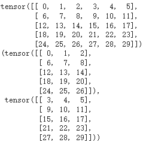

# YOLO v8
```
支援物件偵測、分割、姿勢估計、追蹤和分類。
```  
## architecture
```
介紹: 基於 YOLOv5，並改善了 The C2f module (cross-stage partial bottleneck with two convolutions) 
模型架構: anchor-free model(讓每個分支專注於其任務，並提高模型的整體準確度)
```  
  

<div style="break-after: page; page-break-after: always;"></div> 

### Anchor-Free Model:  
```
理論: 先找中心/中心區域，再預測中心到四邊的距離
特點: 直接預測物體的邊界或關鍵點(物體的中心或角落)。
基於 Transformer 的物件檢測:
1. 利用自注意力機制來捕捉圖像中不同部分之間的關聯，從而直接識別和定位物體。 
2. 使用一組學習對象查詢（object queries）與 Transformer 的解碼器結合，來直接預測一組有限數量的物體邊界框和類別。
```  
  

<div style="break-after: page; page-break-after: always;"></div> 

#### 偏移量計算

- $\Delta x$:  
    ```
    中心點(x)的偏移量
    ```  

    $$\frac{x_{g}-x_{a}}{w_{a}}$$  

- $\Delta x$:  
    ```
    中心點(y)的偏移量
    ```  

    $$\frac{y_{g}-y_{a}}{h_{a}}$$  

- $\Delta w$:  
    ```
    寬度(w)的調整
    ```  

    $$log(\frac{w_{g}}{w_{a}})$$  

- $\Delta h$:  
    ```
    高度(h)的調整
    ```  

    $$log(\frac{h_{g}}{h_{a}})$$  

<div style="break-after: page; page-break-after: always;"></div> 

#### Convolution layer(k, s, p, c):  
```
Convolution2D --> BatchNorm2D --> SiLU
```
##### Convolution2D:  
```
2維卷積運算
```  
  

##### BatchNorm2D:  
```
歸一化(2維)
作用:穩定神經網路品質，減少極大值 or 極小值的出現的比例
```
  

###### 公式:  

$$y=\frac{x-E(x)}{\sqrt{Var(x)+\epsilon}} *\gamma+\beta$$  

- $\epsilon$:  
    ```
    1e-5
    ```  

<div style="break-after: page; page-break-after: always;"></div> 

##### SiLU(Sigmoid-weighted Linear Unit) activation function:  
```
特性：

平滑且非單調：
與 ReLU 在零處有尖銳扭結不同，SiLU 的曲線由於 sigmoid 影響而平滑。
此外，SiLU 不是單調遞增的，這意味著輸出不會隨著輸入的變化而增加或減少。

定義最小值：
SiLU output >= -1 

自穩定(Self-stabilizing)： 
1. 具有 soft floor 效果。 
2. 是一種正歸化器，防止權重在訓練過程中變得太大(導數在 -1.28 左右為零)。

SiLU 即使對於較大的輸入值也能保持非零梯度，有助於函數避免使用 sigmoid 或 tanh 活化時經常遇到的梯度消失問題

優點:

解決 Dying ReLU 問題： 
如果權重和偏置設定不當，ReLU 神經元會變得不活躍（停留在零）。
SiLU 的平滑性有助於避免這個問題。

可與 Batch Normalization 搭配： 
SiLU 的自穩定性有助於結合 Batch Normalization 進行訓練。

缺點:
計算複雜度高，但現在的硬體設備足以支撐

總結:
比 ReLU 更穩定及更平滑、觀察性更好、性能更加
```

  

###### 公式  
$$SiLU(x) = x * sigmoid(x) = x * \frac{1}{1 + e^{-x}}$$  

<div style="break-after: page; page-break-after: always;"></div> 

###### Activation Function 比較圖  
  

#### A spatial pyramid pooling fast (SPPF) layer:  
```
pooling features(特徵) into a fixed-size map，加速計算。
```  
##### Convolution layer:  
```
卷積運算(1維輸入)，與 Convolution layer(k, s, p, c) 相同
```  

##### Maxpooling2d layer:  
```
池化特徵值
作用:將卷積運算完成表，分成 N 個部分，取每個部份的最大值出來
```  
  

- 運算:  

  

<div style="break-after: page; page-break-after: always;"></div> 

##### Concate layer:  
```
利用多個卷積運算提取特徵，並將提取出的特徵融合
```  
  

#### The C2f module  
```
結合高層次特徵 (high-level features) 與情境資訊 (contextual information)，以提高偵測準確度。
過程: Conv(k=1,s=1,p=0,c=c_out) --> Split(分割 Convolution layer 的輸出，一部分導入後面的 Concat Layer，一部分接著輸出) --> Bottlenneck(shortcul = Ture or False) --> Concat(Split_output + Bottlenneck_output) -->  Conv(k=1,s=1,p=0,c=c_out) --> output
```   
  

##### Split  

```python
a = torch.arange(30).reshape(5,6)
print(a)
a.split((3,3),1)
```  
  

<div style="break-after: page; page-break-after: always;"></div> 

##### Bottleneck(shortcul = Ture or False)   
```
降低計算複雜度：
透過使用 1x1 卷積層降低輸入的通道數，減少了後續 3x3 卷積層的計算量。
這對於深層網絡的訓練和推理過程都具有重要意義。

提升特徵提取能力：
3x3 卷積層用於在減少維度後進行特徵提取，增加了網路對輸入特徵的表達能力。
這樣可以在保持較少計算複雜度的同時，提高模型的效能和表示能力。

總結: 
Bottleneck 層在 ResNet 中的應用使得深層網絡的訓練更加容易和高效
```  
  

###### ResNet 架構下的 Bottleneck  
  
    
<div style="break-after: page; page-break-after: always;"></div> 

#### Detect Layer  
```
Anchor-Free model 為基礎，
分為2個分支: Bbox Loss or Cls Loss(BCE Loss)
```  
  
##### Bbox Loss:  
```
回歸分支(DFL + CIoU)
```  

###### DFL(Distribution Focal Loss):  
```
增加 y 的概率，讓模型能更專注的辨識標籤
```  
  

$$DFL(S_{i},S_{i+1})=−((y_{i}+1 − y) log(S_{i}) + (y − y_{i}) log(S_{i}+1)),\quad y_{0}\le \hat{y}\le y_{n}$$  

- $S_{i}$:  
    $$\frac{y_{i+1}-y}{y_{i+1}-y_{i}}$$  

- $S_{i+1}$:  
    $$\frac{y-y_{i}}{y_{i+1}-y_{i}}$$  

- y:  
    $$ y=\int_{-\infty }^{+\infty }\delta(x-y)xdx$$  

- 估計遞迴值($\hat{y}$):  
    ```
    將連續域上的積分轉換為離散表示
    ```  
    $$\hat{y}=\sum_{i=0}^{n}P(y_{i})y_{i}=S_{i}y_{i} + S_{i+1}y_{i+1}=\frac{y_{i+1}-y}{y_{i+1}-y_{i}}y_{i}+\frac{y-y_{i}}{y_{i+1}-y_{i}}y_{i+1}=y$$  

<div style="break-after: page; page-break-after: always;"></div> 

###### CIoU(Completely Intersection over Union)  
```
作用: 預測邊界框與實際邊界框之間的差異

考慮了邊界框之間的三個屬性：
1. 重疊比
2. 中心點之間的距離
3. 長寬比
```   
  

$$L_{CIoU}=1-IoU + \frac{\rho^{2}(b_{p},b_{g})}{c^{2}}+\alpha\frac{4}{\pi^{2}}(tan^{-1}\frac{w_{g}}{h_{g}}-tan^{-1}\frac{w_{p}}{h_{p}})^{2}$$  

- $\rho^{2}(b_{p},b_{g})$:  
    $$\frac{((bg_{x1} + bg_{x2} - bp_{x1} - bp_{x2})^{2}+(bg_{y1} + bg_{y2} - bp_{y1} - bp_{y2})^{2})}{4}$$  

- $c^{2}$:  
    $$(x_{2}-x_{1})^{2}+(y_{2}-y_{1})^{2}+\epsilon$$  

###### IOU(Intersection over Union)  
```
描述邊界框之間重合度的方式，
透過「目標框」與「預測框」的比值來衡量框的回歸程度
```  
  


##### Cls Loss:  
```
分類分支(BCE)  
作用: 判別類別，並輸出類別概率   
```  

###### BCE Loss:  
```
定義: 預測值和實際值的二元交叉熵
```  

$$L_{Cls} = BCE(p,g) = -\frac{1}{4}((g_{1}log(p_{1})+(1-g_{1})log(1-p_{1}))+(g_{2}log(p_{2})+(1-g_{2})log(1-p_{2}))+(g_{3}log(p_{3})+(1-g_{3})log(1-p_{3}))+(g_{4}log(p_{4})+(1-g_{4})log(1-p_{4})))$$   

<script type="text/javascript" src="http://cdn.mathjax.org/mathjax/latest/MathJax.js?config=TeX-AMS-MML_HTMLorMML"></script>
<script type="text/x-mathjax-config"> 
MathJax.Hub.Config({ tex2jax: {inlineMath: [['$', '$']]}, messageStyle: "none" });
</script>
