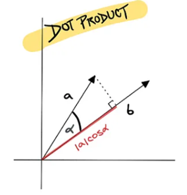
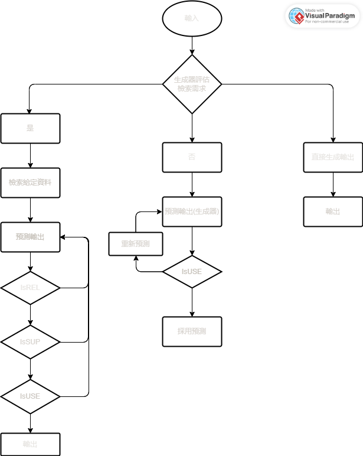
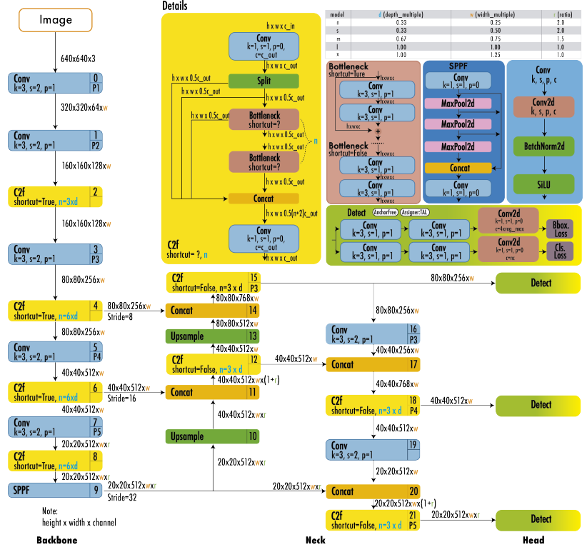
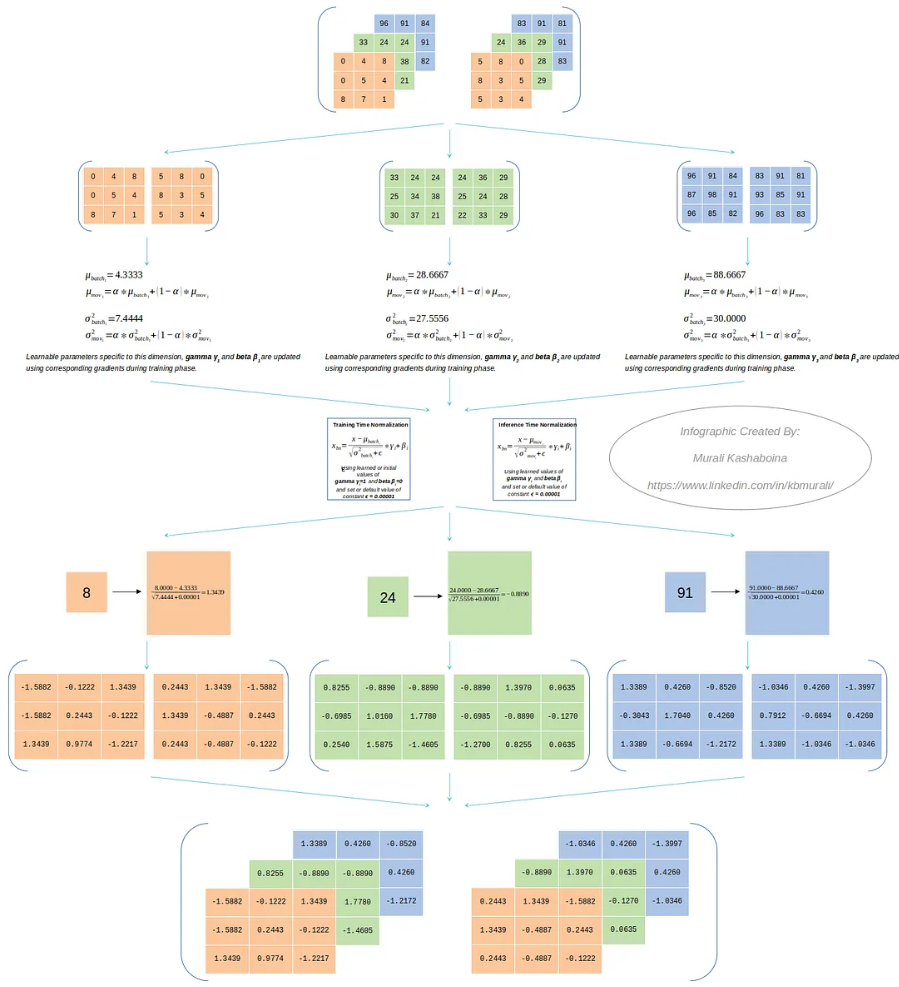
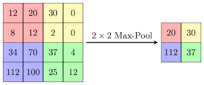
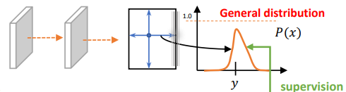
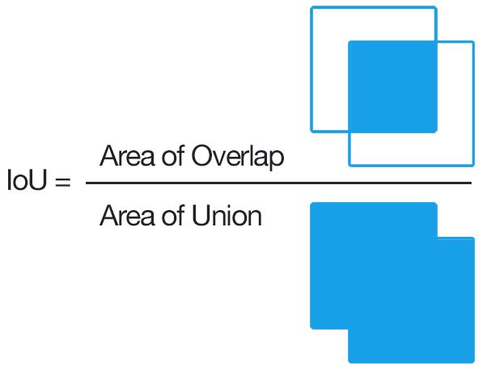
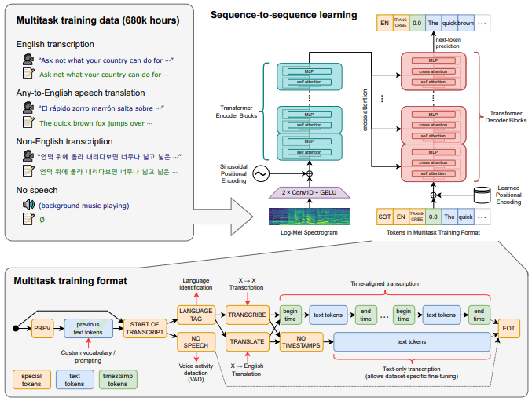
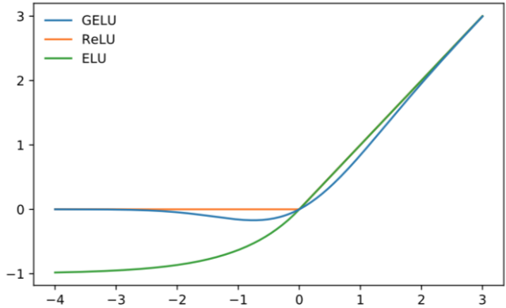

# 個人相關研究
## 目錄
- [RAG](#rag)................................2  
- [Self RAG](#self-rag).........................6  
- [Graph RAG](#graph-rag)....................12  
- [YOLO v8](#yolo-v8)........................25  
- [Whisper](#whisper)..........................34  
- [MLP](#mlp)................................37
- [Self Attention](#self-attention)..................41  
- [Cross Attention](#cross-attention)...............43  


<div style="break-after: page; page-break-after: always;"></div> 

## RAG 
  

### 簡介
```
RAG (Retrieval-Augmented Generation) 是將檢索器與生成器結合起來訓練的模型，透過檢索器可以將外部知識(非記憶參數) 傳輸給生成器(語言模型) 進行邏輯推理
簡單來說，RAG 是不需要經過訓練就能擴充記憶的模型，這會給語言模型帶來很多方便，但不可改變的是語言模型本身的推理邏輯(不同的模型會因為訓練過程不同而導致回答邏輯有些不同)

名詞解釋:
記憶參數: 語言模型訓練時所吸收到的資料(訓練完後固定)
非記憶參數: 語言模型沒有訓練過的資料(不固定，隨著給定的資料更迭)
```  
### 模型架構  
  

<div style="break-after: page; page-break-after: always;"></div> 

#### Retriever  
##### Non-parametric memory  
```
非記憶參數: 不用經由訓練就能使用
RAG 會被廣泛使用的重點原因，可以在不用預先訓練的情況下擴充語言模型原有的知識庫(擴充的知識是暫存的)
檢索器可以讓外部知識更好的相容於生成器(語言模型)
```  
- MIPS(Maximum Inner Product Search)  
      

    $$z = \underset{x \in S}{arg max} x^{\top} q$$

    ```
    MIPS(最大化內積搜索):  
    定義: 即在一個向量集合 S 中，找出一個與查詢向量 q 內積最大的向量 z 

    MIPS(最大化內積搜索) 顧名思義是利用內積來進行搜索, 在 RAG 中會先由檢索器檢索出 (與問題相關的 top-k 個文字序列), 再從挑選出來(top-k)文字序列中, 利用 MIPS 檢索出最相符合的一個文字序列推送給生成器。 
    ```

##### Generator  
- Parametric memory  
    ```
    記憶參數: 經由訓練將知識儲存在生成器(語言模型)
    生成器可以當成是語言模型(Decoder-only 居多)，透過語言模型強大的推理及生成能力，讓 RAG 能解決更多問題(問答任務)，更有趣的是，每個語言模型所生成出來的內容都會不同(給定的知識相同)，這會讓 RAG 有更多元的表現
    ```

<div style="break-after: page; page-break-after: always;"></div> 

### 模型類型  
#### RAG-Sequence Model  


  

- Neural Knowledge Retriever(檢索器)  
    $$\boldsymbol{p}_{\eta}(z|x)$$  
    ```
    檢索器:
    負責檢索出與問題相關的序列，並傳輸給生成器進行邏輯處理並輸出
    ```
- Knowledge augmented Classifier(知識分類器)  
    $$\boldsymbol{p}_{\theta}(y|x,z)$$  
    ```
    知識分類器:
    作用與生成器相同,將檢索器檢索完的知識進行邏輯推理，得出最好的結果
    補充:
    生成器會考慮自身的記憶邏輯，以人來說就是已知的知識
    ```

<div style="break-after: page; page-break-after: always;"></div> 

#### RAG-Token Model  

  

- Neural Knowledge Retriever(檢索器)  
    $$\boldsymbol{p}_{\eta}(z|x)$$  
    ```
    檢索器:
    負責檢索出與問題相關的序列，並傳輸給生成器進行邏輯處理並輸出

    與 RAG-Sequence Model 不同的點:
    RAG-Token Model 可以檢索多文件
    因為可以檢索多個文件，使得檢索器必須知道各個序列是否與問題有相關聯
    ```
- Knowledge augmented Classifier(知識分類器)  

      

    ```
    知識分類器:
    作用與生成器相同,將檢索器檢索完的知識進行邏輯推理，得出最好的結果

    補充:
    生成器會考慮自身的記憶邏輯，以人來說就是已知的知識

    與 RAG-Sequence Model 不同的點:
    需要吸收來自不同文件的資訊，會讓生成器所產生的內容更加廣泛且更加嚴謹
    ```  

<div style="break-after: page; page-break-after: always;"></div> 

## Self RAG
### 簡介  
```
Self-RAG 是基本 RAG 的改良版，改善了 RAG 會遇到的問題！
RAG 的問題：
1.回答偏離主題且檢索出來的內容有時會過於冗長
2.不會理會輸入與輸出是否相關，導致輸出會產生與事實不相符合的問題
3.降低了語言模型的生成多樣性
4.無法保證輸入與檢索出的內容有無相關  

為了改善上述問題，就在 Self-RAG 中加入了反省機制，也是因為有了反省機制，讓輸出變得完整且多樣化！
```  
### 架構(推理流程)  
  
```
Self-RAG 整體是由3個模型組合而成的，各自有著不同的任務
3個模型分別為：
1.Retriever: 
負責檢索與輸入相關的段落

2.Generator LM:
根據輸入的內容預測輸出(需要檢索時，會參考給定的資料進行預測)

3.Critic model:
Self-RAG 新增的反省機制，可以阻止語言模型產生幻覺或是提高檢索器的檢索品質
```

<div style="break-after: page; page-break-after: always;"></div> 

#### IsREL  
```
判斷檢索到的段落對於回答問題有沒有作用，附加 critique tokens
```  
- input: 問題、檢索到的段落  
- output: 有作用、沒作用  
- critique tokens: {有作用,沒作用}  

#### IsSUP  
```
判斷預測輸出有沒有足夠的事實依據來支持(符不符合現實情況)，附加 critique tokens
```  
- input: 問題、檢索到的段落、預測的輸出  
- output: 充分支持、大部分支持、不支持  
- critique tokens: {充分支持,大部分支持,不支持}  

#### IsUSE  
```
判斷語言模型預測的輸出回答問題的程度，
以數字表示(數字越大表示答案能解決問題的程度越高)，
附加 critique tokens
```  
- input: 問題、預測的輸出  
- output: 1~10(數字自訂，用來表示程度)  
- critique tokens: {1,2,3,4,5,6,7,8,9}  

### Critic Model
```
以語言模型為初始化的訓練依據，產生反省標記(reflection tokens)做為知識儲存

備註: 產生標記的品質會隨著語言模型而有所變動
作用: 用來幫助生成器評估段落的品質

細部程序:
第一步: 評估每個檢索段落是否與輸入相關(IsREL，附加 critique tokens)
第二步: 如果段落是相關的，評估能否支援生成器預測輸出(IsSUP，附加 critique tokens)
第三步: 評估預測的輸出回答問題的品質(IsUSE)
```
#### reflection tokens 格式  
    

```
不同的(reflection tokens)組有不同的定義及輸入用來預測為文字，對於評估輸出有很大的幫助，資料越多，越接近於人類的評估
已知 I, x, y 的情況下，將(reflection tokens)預測為文字
I: 示範例子(少量)
x: 輸入(以當下情況為主)
y: 預測的輸出(每個語言模型所預測的輸出皆有些許差異)
```
$$p(r|I,x,y)$$  

#### Critic Model 
```
以語言模型的基本建模理論為底，並最大化其可能(maximizing likelihood)
```  
  

### Generator Model
```
訓練資料:
Critic Model 執行完後的(reflection tokens) 和原本的輸入輸出
先使用 Critic Model 來幫助生成器的生成品質
訓練內容:
1.預測輸出
2.reflection tokens
```  

<div style="break-after: page; page-break-after: always;"></div> 

#### 遮罩(Mask) 格式  
```
作用: 遮蔽檢索到的文字段落，計算損失值
格式: <p> 文字內容 <p>
```

#### reflection tokens  
```
作用: 擴充詞彙表內容(知識擴充)
格式: {Critique, Retrieve} 
```
  

### Self-RAG 細談
```
Self-RAG 改善的成果:
1.讓檢索的次數增加，確保輸出與檢索出的內容能更與事實相符(能被客觀證據證明)
2.在 Open-domain 的情況下，會優先考慮創意及多樣性(減少檢索次數)
3.設定臨界值，讓檢索器中的所有標記都有參考依據(是否啟動檢索)，超過臨界值啟動；不超過則不啟動
4.新增了 critique tokens， 讓反省機制能更加成熟，
當需要檢索時， 會開始加入 critique tokens， 直到 IsUSE
5.在每個步驟加入評估分數，用(critic score S)來做迭代
6.加入(segment-level beam search)，讓(IsREL、IsSUP、IsUSE)經由分數評比(beam-search score)選出最好的段落
```
#### segment score(單個段落分數)  
```
作用:
幫助反省機制的運行，增強 Critic Model 的效果
```  
  

##### critic score S  
```
每個 critique tokens 的分類，用歸一化概率的線性加權總和(linear weighted sum of the normalized probability) 
```  
  

- $s^{G}_{t}$  
    ```
    產生最理想 reflection tokens 的機率 
    ```  
       

#### beam-search score  
```
以標準化機率來計算(IsREL、IsSUP、IsUSE)的 beam-search score
```  
##### For IsREL  

   

##### For IsSUP  
$$s(IsSUP)=\frac{p(IsSUP=充分支持)}{S}+\frac{p(IsSUP=大部分支持)}{S}\times 0.5+\frac{p(IsSUP=不支持)}{S}\times 0$$  

- S:  
       

<div style="break-after: page; page-break-after: always;"></div> 


##### For IsUSE  
```
給予加權並分配，讓分數階級更有差異性
```  

$$s(IsUSE)=\sum_{i}^{9}w_{i}\frac{p(IsUSE=i)}{S}$$  

- S:  

        

- $w_{i}$:  

      
    
#### adaptive retrieval(自適應檢索器)  
```
設定條件，讓檢索器能選擇開始檢索或停止檢索
```  

<div style="break-after: page; page-break-after: always;"></div> 

## Graph RAG

### 簡介
```
Graph-RAG 是將基礎的 RAG (向量資料庫) 改成圖資料庫為主的知識圖表，
簡單來說，就是把檢索分成2個階段: 
第一階段:
將參考文件以圖表的方式畫出來，並標記好所有的社群關係，
從(每個)社群關係中找出重點摘要
第二階段:將每個重點摘要統整出最後的答案

結論: 
Graph-RAG 在生成答案的多元性及完整性都高於基礎的 RAG 許多(因為有圖表檢索的幫助)
```

<div style="break-after: page; page-break-after: always;"></div> 

### (推理)流程
  
### Source Documents → Text Chunks  
```
從參考文件中把與輸入問題相關的段落檢索出來，
並將檢索出來的段落分成多個文字區塊。
每一個文字塊會搭配一組提示詞彙,以抽取圖形索引的各種元素。

備註:
1. 較長的文字塊進行類別檢索時，需要啟用語言模型的次數並不多，
但會因為較長的文字區塊而導致語言模型的記憶力下降。
2. 較小的 chunk size 需要的實際參考值越高
3. 一般而言引用越多越好，但檢索過程需要平衡執行任務的呼叫次數與精確度。
```  
#### Text Chunks → Element Instances  
```
從每段檢索出來的文字中識別並擷取圖形節點和邊緣的物件(使用 multipart LLM prompt 來完成)，
需要找出(物件名稱、類型、敘述、所有物件間的關聯性)，
來源實例(Instances)及目標實例(Instances)都會個別以(Tuple)的形式輸出
如果沒有擷取仔細或是有漏掉，
需要進行第二次檢索(還有一種特例，碰到專門領域的知識時)

備註:
1.遇到不同領域的文件需要訂製語料庫
2.多次檢索可以有效提升知識圖表的品質
3.多次檢索會使用到 Self-RAG 的概念(要求語言模型評估是否有漏掉的細節)
```  
<div style="break-after: page; page-break-after: always;"></div>

#### Element Instances → Element Summaries  
```
抽象摘要: 使用 LLM 來「擷取」原始文字中所代表的實體、關係和主張的描述
將所有檢索出來的(實例摘要)轉換成圖表元素(多個) 的文字區塊(清晰描述)，
為了轉換成圖表元素(需要再進行一次 LLM 摘要，
利用 LLM 本身的邏輯來進行擷取重點並轉換成圖表元素)。
此步驟建立的索引類似(同質無向加權圖 undirected weighted graph)

同質無向加權圖 undirected weighted graph:
實體節點由關係邊連接，而邊的權重為偵測到的關係實例(利用標準化計數)

可能會出現的問題: 
LLM 可能無法以相同的文字格式持續擷取對同一個實體的引用，
造成重複的實體元素，進而造成實體圖中重複的節點。
不過，由於所有相關的實體「群組」都會在下一步中被偵測與總結，
加上 LLM 可以理解多重名稱變異背後的共同實體，
因此只要所有變異與相關實體的共用點有足夠的關聯性，
整體方法對於變異是有彈性的。
總而言之，
需要再可能會產生雜訊的圖表結構中，
使用豐富的描述性文字來處理同質節點，
這符合 LLM 的能力，以及全局性、以查詢為重點的總結需求。
這些特質也讓圖表索引有別於典型的知識圖表，
(典型的知識圖表)依賴簡潔一致的知識三元組(主體、謂語、客體)來進行推理任務。
```
#### Element Summaries → Graph Communities  
```
使用 Leiden 演算法來將圖表劃分為多個群組(群組中的關係強度遠大於群組外部)，
以互斥(mutually exclusive)、集體窮盡(collective exhaustive)的方式涵蓋圖表的節點，
從而實現分而治之(divide and conquer)的全局總結(global summarization)
```  

<div style="break-after: page; page-break-after: always;"></div>

#### Graph Communities → Community Summaries  
```
將資料集擴充至超大型資料集所設計的方法，
幫助 Leiden 層級架構中的每個群落建立重點摘要。
摘要很有用，可以了解資料集的整體結構和語意，
在沒有問題的情況下，摘要也可以用來釐清語料的意義，
把主要的重點放在回答全局查詢的圖形索引的其中一部分。

群落摘要 (Community Summaries) 的產生方式：
1. Leaf-level communities (樹葉型的群落): 
把 (Leaf-level communities) 的元素摘要
（nodes、edges、共變數(covariates)）排序，
然後反復加入 LLM 的 (context) ，直到達到符號限制為止。
優先順序：
每個社群邊緣 (community edge)，
依來源與目標節點合併程度的遞減順序，
加入來源節點、目標節點、連結共變數以及(edge)本身的描述。

2. Higher-level communities (高階的群落): 
如果所有元素摘要都在 (LLM contexts) 的符號限制內，
則採取與葉層群落相同的步驟，
(Community Summaries) 內的所有元素摘要 (element summaries)。
否則，會以 (element summaries) 符號遞減的順序排列子群落，
並以子群落摘要（較短）取代相關元素摘要（較長），
直到符合 (LLM contexts) 為止。
```  

<div style="break-after: page; page-break-after: always;"></div>

##### MultiHop-RAG 圖形群組索引(Graph communities)(使用 Leiden 演算法)  
  

```
節點佈局透過 OpenORD 和 Force Atlas 2 (演算法)執行(節點顏色代表實體群落)
```  
- 分層聚類:  
    - Level 0:  
        ```
        具有最大模組化的層次分割(hierarchical partition with maximum modularity)
        ```  
    - Level 1:  
        ```
        顯示根部(底層)群落的內部結構(internal structure within root-level communities)
        ```

<div style="break-after: page; page-break-after: always;"></div> 

#### Community Summaries → Community Answers → Global Answer  
```
社群摘要(上一步產生)用於在此階段產生最終答案(輸入:使用者提問)
社群結構的層級性質也意味著可以使用不同層級的社群摘要來回答問題，
這也提出了一個問題：
在層級性社群結構中，
某個特定層級是否提供了摘要細節與一般感知問題範圍的最佳平衡
```  
##### 對於特定的社群層級，答案產生方式  
- 準備社群摘要(Prepare community summaries):  
    ```
    社群摘要會隨機洗牌，並分割成預先指定代幣大小的區塊。
    這可確保相關資訊分佈在各個區塊中，
    而不是集中在單一上下文視窗中 (並可能遺失)。
    ```  
- 映射社群答案(Map community answers):  
    ```
    並行產生中間答案，每個分塊一個。
    LLM 也會被要求產生 0-100 分之間的分數，
    表示所產生的答案對回答目標問題的幫助程度。
    得分為 0 的答案會被篩選出來。
    ```  
- 還原為全局答案(Reduce to global answer):  
    ```
    中間的社群答案會依有用性分數從高到低排序，
    並反覆加入新的上下文視窗，直到達到代幣限制為止。
    這個最終的上下文會用來產生回傳給使用者的全局答案。
    ```  

<div style="break-after: page; page-break-after: always;"></div>

### Knowledge Graph
```
定義: 累積和傳達現實世界知識的資料圖形

Knowledge Graph (知識圖表): 
1. 儲存在圖資料庫 
2. 以圖描述實體 (物件、事件、情境、概念) 之間的關係
3. 儲存內容: 
文本資料(包含相互關係) + 組成原則(organizing principles)

Knowledge Graph 的組成:
Nodes: 表示相關的實體(the entities of interest)
Edges: 表示實體間的關係(relations between the entities)
```  
 


<div style="break-after: page; page-break-after: always;"></div>

#### Key Characteristics(特性)  
##### Nodes  
```
儲存實體的相關資訊(人、地方、物件、機構等...)，
相比普通資料庫增加了可讀性及檢索的全面性
```


##### Relationships  
```
表示實體之間的關係
```  


<div style="break-after: page; page-break-after: always;"></div> 

##### Organizing Principle:  
```
一種核心假設，
所有的東西都可以從這個核心假設中得到分類或價值(可提供靈活的概念性結構)
假設: 
一個中心參考點，讓其他物件都能被定位，通常用在概念架構中
```

  

```
Organizing:
對特定領域的概念(包含概念之間關係)的正式說明
常見的表示方式:圖形網路表示
```  

<div style="break-after: page; page-break-after: always;"></div>

#### Knowledge Graph 相關技術
##### Knowledge Graph Embedding
```
將知識圖形的實體和關係映射到低維向量空間，
以便有效地捕捉知識圖形的語義和結構，
得到的特徵向量可以用來訓練模型，
使其更能應用在人工智慧上
```  
###### Embedding methods

```
Tensor factorization-based:
基於矩陣分解的方法通過從
使用者（user）和項目（item）中提取潛在因子（latent factor）
來調整總體評級以進行推薦
```  


<div style="break-after: page; page-break-after: always;"></div> 

$$\underset{U,V}{argmin}=\sum_{i=0}^{m}\sum_{j=0}^{n}(D_{i,j}-\hat{D}_{i,j})^{2}$$  

$U_{i}$:   
```
Matrix U 第 i 行的向量。
```  

$V_{j}$:   
```
Matrix V 第 j 行的向量。
```   

$\hat{D}_{i,j}$:  

  


<div style="break-after: page; page-break-after: always;"></div>

```
Knowledge Acquisition(擷取):
著重於知識圖形的建模與建構，知識是透過映射語言從結構化的來源匯入，
也可以採用關係、實體或屬性萃取方法，
從非結構化文檔（例如新聞、研究論文等...）中萃取知識
```  


```
Knowledge Graph Completion:
大多數的知識圖表仍然缺乏大量的實體和關係
使用2種方式來改善(知識圖表必須是靜態):
1.採用連結預測技術來產生三元組，然後給予三元組可信度分數
2.採用實體預測方法，從外部來源取得並整合進一步的資訊
```  

<div style="break-after: page; page-break-after: always;"></div> 

```
Knowledge Fusion
定義: 將來自不同知識來源的知識整合，以提高系統的可解釋性和穩健性

可分為以下幾種類型:
1.規則知識融合(Rule-Based Knowledge Fusion, RBKF)：
將來自不同規則知識來源的知識進行融合，
以提高系統的可解釋性和穩健性
2.例子知識融合(Example-Based Knowledge Fusion, EBKF)：
將來自不同例子知識來源的知識進行融合，
以提高系統的可解釋性和穩健性
3.結構知識融合(Structural Knowledge Fusion, SKF)：
將來自不同結構知識來源的知識進行融合，
以提高系統的可解釋性和穩健性

核心原理與具體操作步驟:
1. 知識預處理：將不同知識來源的資訊清洗、轉換與整合
2. 知識擷取：從知識來源中提取有意義的知識，以便進行後續的知識融合
3. 知識融合：將不同知識來源的知識整合，以得到融合後的知識
4. 結果解釋：對融合後的知識進行解釋和分析，以提高系統的可解釋性和穩健性
```

$$K = \frac{\sum{i=1}^{n} wi \cdot ki}{\sum{i=1}^{n} w_i}$$


$K$:   
```
融合後的知識
```  

$wi$:   
```
每個知識來源的權重
```  

$ki$:   
```
每個知識來源的知識
```

```
Knowledge Reasoning:
定義: 根據現有資料推斷出新的事實

主要方法包括：
1. 基於邏輯規則的推理(logic rule-based)
2. 基於分散表示的推理(distributed representation-based methods)
3. 基於神經網絡的推理(neural network-based methods)
```  

<div style="break-after: page; page-break-after: always;"></div> 

## YOLO v8
```
支援物件偵測、分割、姿勢估計、追蹤和分類。
```  
### architecture
```
介紹: 基於 YOLOv5，並改善了 The C2f module (cross-stage partial bottleneck with two convolutions) 
模型架構: anchor-free model(讓每個分支專注於其任務，並提高模型的整體準確度)
```  
  

<div style="break-after: page; page-break-after: always;"></div> 

#### Anchor-Free Model  
```
理論: 先找中心/中心區域，再預測中心到四邊的距離
特點: 直接預測物體的邊界或關鍵點(物體的中心或角落)。
基於 Transformer 的物件檢測:
1. 利用自注意力機制來捕捉圖像中不同部分之間的關聯，從而直接識別和定位物體。 
2. 使用一組學習對象查詢（object queries）與 Transformer 的解碼器結合，來直接預測一組有限數量的物體邊界框和類別。
```  
  

##### 偏移量計算

- $\Delta x$:  
    ```
    中心點(x)的偏移量
    ```  

    $$\frac{x_{g}-x_{a}}{w_{a}}$$  

- $\Delta x$:  
    ```
    中心點(y)的偏移量
    ```  

    $$\frac{y_{g}-y_{a}}{h_{a}}$$  

- $\Delta w$:  
    ```
    寬度(w)的調整
    ```  

    $$log(\frac{w_{g}}{w_{a}})$$  

- $\Delta h$:  
    ```
    高度(h)的調整
    ```  

    $$log(\frac{h_{g}}{h_{a}})$$  

<div style="break-after: page; page-break-after: always;"></div> 

##### Convolution layer(k, s, p, c)  
```
Convolution2D --> BatchNorm2D --> SiLU
```
###### Convolution2D:  
```
2維卷積運算
```  
  

###### BatchNorm2D:  
```
歸一化(2維)
作用:穩定神經網路品質，減少極大值 or 極小值的出現的比例
```
   

$$y=\frac{x-E(x)}{\sqrt{Var(x)+\epsilon}} *\gamma+\beta$$  

- $\epsilon$:  
    ```
    1e-5
    ```  

<div style="break-after: page; page-break-after: always;"></div> 

###### SiLU(Sigmoid-weighted Linear Unit) activation function:  
```
特性：

平滑且非單調：
與 ReLU 在零處有尖銳扭結不同，SiLU 的曲線由於 sigmoid 影響而平滑。
此外，SiLU 不是單調遞增的，這意味著輸出不會隨著輸入的變化而增加或減少。

定義最小值：
SiLU output >= -1 

自穩定(Self-stabilizing)： 
1. 具有 soft floor 效果。 
2. 是一種正歸化器，防止權重在訓練過程中變得太大(導數在 -1.28 左右為零)。

SiLU 即使對於較大的輸入值也能保持非零梯度，有助於函數避免使用 sigmoid 或 tanh 活化時經常遇到的梯度消失問題

優點:

解決 Dying ReLU 問題： 
如果權重和偏置設定不當，ReLU 神經元會變得不活躍（停留在零）。
SiLU 的平滑性有助於避免這個問題。

可與 Batch Normalization 搭配： 
SiLU 的自穩定性有助於結合 Batch Normalization 進行訓練。

缺點:
計算複雜度高，但現在的硬體設備足以支撐

總結:
比 ReLU 更穩定及更平滑、觀察性更好、性能更加
```

  
 
$$SiLU(x) = x * sigmoid(x) = x * \frac{1}{1 + e^{-x}}$$  

<div style="break-after: page; page-break-after: always;"></div> 

  

##### A spatial pyramid pooling fast (SPPF) layer:  
```
pooling features(特徵) into a fixed-size map，加速計算。
```  
###### Convolution layer:  
```
卷積運算(1維輸入)，與 Convolution layer(k, s, p, c) 相同
```  

###### Maxpooling2d layer:  
```
池化特徵值
作用:將卷積運算完成表，分成 N 個部分，取每個部份的最大值出來
```  
  

- 運算:  

  

<div style="break-after: page; page-break-after: always;"></div> 

###### Concate layer:  
```
利用多個卷積運算提取特徵，並將提取出的特徵融合
```  
  

##### The C2f module  
```
結合高層次特徵 (high-level features) 與情境資訊 (contextual information)，以提高偵測準確度。
過程: Conv(k=1,s=1,p=0,c=c_out) --> Split(分割 Convolution layer 的輸出，一部分導入後面的 Concat Layer，一部分接著輸出) --> Bottlenneck(shortcul = Ture or False) --> Concat(Split_output + Bottlenneck_output) -->  Conv(k=1,s=1,p=0,c=c_out) --> output
```   
  

###### Split  

```python
a = torch.arange(30).reshape(5,6)
print(a)
a.split((3,3),1)
```  
  

<div style="break-after: page; page-break-after: always;"></div> 

###### Bottleneck(shortcul = Ture or False)   
```
降低計算複雜度：
透過使用 1x1 卷積層降低輸入的通道數，減少了後續 3x3 卷積層的計算量。
這對於深層網絡的訓練和推理過程都具有重要意義。

提升特徵提取能力：
3x3 卷積層用於在減少維度後進行特徵提取，增加了網路對輸入特徵的表達能力。
這樣可以在保持較少計算複雜度的同時，提高模型的效能和表示能力。

總結: 
Bottleneck 層在 ResNet 中的應用使得深層網絡的訓練更加容易和高效
```  
  

ResNet 架構下的 Bottleneck  
  
    
<div style="break-after: page; page-break-after: always;"></div> 

##### Detect Layer  
```
Anchor-Free model 為基礎，
分為2個分支: Bbox Loss or Cls Loss(BCE Loss)
```  
  
###### Bbox Loss:  
```
回歸分支(DFL + CIoU)
```  

DFL(Distribution Focal Loss)  
```
增加 y 的概率，讓模型能更專注的辨識標籤
```  
  

$$DFL(S_{i},S_{i+1})=−((y_{i}+1 − y) log(S_{i}) + (y − y_{i}) log(S_{i}+1)),\quad y_{0}\le \hat{y}\le y_{n}$$  

- $S_{i}$:  
    $$\frac{y_{i+1}-y}{y_{i+1}-y_{i}}$$  

- $S_{i+1}$:  
    $$\frac{y-y_{i}}{y_{i+1}-y_{i}}$$  

- y:  
    $$ y=\int_{-\infty }^{+\infty }\delta(x-y)xdx$$  

- 估計遞迴值($\hat{y}$):  
    ```
    將連續域上的積分轉換為離散表示
    ```  
    $$\hat{y}=\sum_{i=0}^{n}P(y_{i})y_{i}=S_{i}y_{i} + S_{i+1}y_{i+1}=\frac{y_{i+1}-y}{y_{i+1}-y_{i}}y_{i}+\frac{y-y_{i}}{y_{i+1}-y_{i}}y_{i+1}=y$$  

<div style="break-after: page; page-break-after: always;"></div> 

CIoU(Completely Intersection over Union)  
```
作用: 預測邊界框與實際邊界框之間的差異

考慮了邊界框之間的三個屬性：
1. 重疊比
2. 中心點之間的距離
3. 長寬比
```   
  

$$L_{CIoU}=1-IoU + \frac{\rho^{2}(b_{p},b_{g})}{c^{2}}+\alpha\frac{4}{\pi^{2}}(tan^{-1}\frac{w_{g}}{h_{g}}-tan^{-1}\frac{w_{p}}{h_{p}})^{2}$$  

- $\rho^{2}(b_{p},b_{g})$:  
    $$\frac{((bg_{x1} + bg_{x2} - bp_{x1} - bp_{x2})^{2}+(bg_{y1} + bg_{y2} - bp_{y1} - bp_{y2})^{2})}{4}$$  

- $c^{2}$:  
    $$(x_{2}-x_{1})^{2}+(y_{2}-y_{1})^{2}+\epsilon$$  

```
IOU(Intersection over Union)
描述邊界框之間重合度的方式，
透過「目標框」與「預測框」的比值來衡量框的回歸程度
```  
  

```
Cls Loss: 
分類分支(BCE)  
作用: 判別類別，並輸出類別概率   

BCE Loss:
定義: 預測值和實際值的二元交叉熵
```  

$$L_{Cls} = BCE(p,g) = -\frac{1}{4}((g_{1}log(p_{1})+(1-g_{1})log(1-p_{1}))+(g_{2}log(p_{2})+(1-g_{2})log(1-p_{2}))+(g_{3}log(p_{3})+(1-g_{3})log(1-p_{3}))+(g_{4}log(p_{4})+(1-g_{4})log(1-p_{4})))$$   
$$\frac{p(Retrieve=YES)}{p(Retrieve=YES)+p(Retrieve=NO)}\gt \delta$$  

<div style="break-after: page; page-break-after: always;"></div> 

## Whisper
```
簡介: 1(音訊) 對 多(轉錄、翻譯、語言辨識) 模型
基礎模型: Encoder-Decoder Transformer
Input(音訊): 進行特徵縮放(將數值壓在 -1 ~ 1 之間) 
Output(文本): 解碼器輸出(文本)
```  
  

<div style="break-after: page; page-break-after: always;"></div> 

### 2 * Conv1D + GELU  
#### GELU(Gaussian Error Linear Units)  
```
定義: 模擬自然神經元，結合線性及非線性激活函數，讓激活效果更好。

優點:
1.平滑性：
相較於ReLU及其變種，GELU函數在整個實數域上是連續且光滑的，這有助於在訓練過程中梯度更容易傳播，進而提高模型的訓練效率和收斂速度。

2.飽和度控制：
GELU在較大輸入時不會像sigmoid那樣飽和，也不會像ReLU那樣在大於0的區域產生恆定斜率，而是根據輸入值的大小提供不同的非線性程度。

3.減少過度擬合：
GELU的隨機性和對輸入分佈的適應性有助於減輕過度擬合現象，使得模型在處理複雜任務時表現更好。

缺點:
1.運算效率：
不是簡單的閾值函數，公式涉及誤差函數，導致計算相對複雜且耗時。

2.近似誤差：
在實際應用中，由於誤差函數的複雜性，通常會使用近似公式替代，導致精度損失。

3.初始化敏感性：
GELU相對於ReLU等函數可能對模型權重的初始值更為敏感，不當的初始化可能會導致訓練初期梯度消失或爆炸的問題。
```  

##### 激活函數比較  
```
GELU 擁有更好性能和收斂速度
輸入值較小，輸出較小的非線性響應；
輸入值增大，非線性響應逐漸增強，同時保持了負輸入區域的部分響應
```  
  

- 各種激活函數:  
      


  

### Encoder Blocks  
```
多個小層(MLP + self attentoin)組成
MLP 和 self attentoin 詳細內容在後方
```  
      
### Decoder Blocks  
```
多層(self-attention + cross-attention + MLP)
MLP 和 self attentoin 詳細內容在後方
```  

<div style="break-after: page; page-break-after: always;"></div> 

## MLP
```
結構: 輸入(Input)層 --> 隱藏(Hidden)層 --> 輸出(Output)層
定義: 前向傳遞類神經網路
```  
  

### Input layer --> Hidden layer  
#### Input layer --> Hidden layer input 

$$H_{j}=\sum_{i=0}^{d}v_{ij}x_{i}$$  

- $v_{ij}$:  
    ```
    第i個輸入到第j個hidden node的權重
    ```  

- Hidden layer input --> Hidden layer output:  
    ```
    經過激活函數產生 Hidden layer output
    ```  

    $$H_{o}=activation(H_{j})$$  
        
#### Hidden layer --> Output layer   
- Hidden layer --> Output layer input:  

    $$O_{j}=\sum_{o=0}^{p}w_{oi}H_{o}$$  

- Output layer input --> Output layer output(y):  

      

<div style="break-after: page; page-break-after: always;"></div> 

#### 反向傳遞 (Backward propagation)  
```
利用反向傳遞進行參數更新(直到誤差收斂)
```  
##### Output --> Hidden layer output  
```
偏微分方程
```  

$$\frac{\partial E^{(i)}}{\partial w_{oi}} = \frac{\partial E^{(i)}}{\partial O_{j}}*\frac{\partial O_{j}}{\partial w_{oi}}$$  

- $\frac{\partial E^{(i)}}{\partial O_{j}}$  

  

- $\frac{\partial O_{j}}{\partial w_{oi}}$  

$$\frac{\partial O_{j}}{\partial w_{oi}}=\frac{\partial \sum_{i=0}^{q}w_{oi}H_{o}}{\partial w_{oi}}=H_{o}$$  


<div style="break-after: page; page-break-after: always;"></div> 

##### Hidden layer --> Input layer  

  

- $\frac{\partial E^{(i)}}{\partial O_{j}}$:  
  

- $\frac{\partial O_{j}}{\partial H_{j}}$:  
$$\frac{\partial O_{j}}{\partial H_{j}}=w_{oi}activationfunction^{'}(H_{j}^{(i)})$$  

- $\frac{\partial H_{j}}{\partial v_{ij}}$:  
$$\frac{\partial \sum_{i=0}^{d}v_{ij}x_{i}}{\partial v_{ij}}=x_{i}$$  


<div style="break-after: page; page-break-after: always;"></div> 

##### 最佳參數解  
```
利用反向傳遞 (Backward propagation) 找出
```  
- $v_{ij}$  
$$v_{ij}=v_{ij}-\eta\Delta v_{ij}$$  

- $\Delta v_{ij}$  
  

- $w_{oi}$  

$$w_{oi}=w_{oi}-\eta\Delta w_{oi}$$  

- $\Delta w_{oi}$  

  

<div style="break-after: page; page-break-after: always;"></div> 

## Self Attention
  

### Scaled Dot-Product Attention
```
類似於 dot-product (multiplicative) attention
```
$Attention(Q,K,V)=softmax(\frac{QK^{T}}{\sqrt{d_{k}}})V$ 
- 注意力權重： $softmax(\frac{QK^{T}}{\sqrt{d_{k}}})$  

- $\sqrt{d_{k}}$ 的重要性：  
$d_{k}$較大時，點積運算毀使幅度越來越大，將 softmax() 引導至梯度極小值的區域，所以需要 $\sqrt{d_{k}}$ 來對點積進行縮放。  

- Q、K、V 皆為矩陣  

<div style="break-after: page; page-break-after: always;"></div> 

### Multi-Head Attention
改善單頭注意力模式下，平均化抑制注意力權重的問題：  
1.將 Q,K,V 投影至 $d_{k},d_{k},d_{v}$  
2.$d_{k},d_{k},d_{v}$  並行執行注意力函數，取得 $d_{v}$ 的輸出值  
```
允許模型在不同位置共同關注來自不同特徵子空間的資訊。
    
Transformer 中的使用方式:
1. Encoder-Decoder layer: 
使得解碼器中的每個位置都能專注於輸入序列中的所有位置。(模仿 cross-attention)

2. self-attention layer:
讓 Encoder 中的每個位置都可以專注於編碼器上一層的所有位置。

3. Dncoder:
與 Encoder 中 self-attention layer 一樣，但需要防備信息回流(保持 Autoregressive)。
防備方式: 
屏蔽（設定為-∞）softmax() 中所有對應於錯誤的值，才能在 Scaled Dot-Product Attention 實現。
```

$$MultiHead(Q,K,V) = Concat(head_{1}, ..., head_{h})W^{o}$$  

where $$headi = Attention(QW_{i}^{Q},KW_{i}^{K},VW_{i}^{V})$$  

$$W_{i}^{Q}\in \mathbb{R}^{d_{model}\times d_{k}},W_{i}^{K}\in \mathbb{R}^{d_{model}\times d_{k}},W_{i}^{V}\in \mathbb{R}^{d_{model}\times d_{k}},W^{o}\in \mathbb{R}^{hd_{model}\times d_{k}}$$  

<div style="break-after: page; page-break-after: always;"></div> 

## Cross Attention
```
使用於 Encoder-Decoder, 對 machine translation 極為重要(與 self-attention 相比)

與 self-attention 的差異:  
1.cross-attention 要注意 pruning 的使用(cross-attention 對 pruning 非常的敏感,過度使用會導致品質下降)  
2. 無法使用對應方法替代(hard-coded),不會影響性能(替代方法舉例: input-independent Gaussian distribution)
```
  

### pruning
```
定義: 一種模型壓縮的方式，有效地精簡模型參數並最小化損失。  

應用:  
1.多層感知機(MLP)  
2.卷積神經網路(CNN)   
3.機器翻譯(MT)

運用在 machine translation 的效果:
transfer learning(遷移學習): 分別訓練(parent model and child model)  
1. parent model(high-resource language pair):  
用於資料較多(parallel data)的語言  

2. child model(low-resource language pair):  
用於新的語言或是資料較少(parallel data)的語言 

好處:
1.減少災難性遺忘(catastrophic forgetting)的可能性
2.開發出不需要樣本即可翻譯的潛能
3.可翻譯多種語言，並減少儲存參數的消耗
```  

<div style="break-after: page; page-break-after: always;"></div> 

### transfer learning(遷移學習)
  
- a. 從頭完整訓練模型  
- b. 標準方式微調(fine-tuning)模型(src+body)  
- c. 使用(cross-attention)微調模型(src+xattn)  
- d. fine-tuning new vocabulary (src)
- e. 進行語言翻譯時，微調 cross-attention（tgt+xattn）  
- f. 從頭更新 (cross-attention) 的遷移學習(transfer learning)  
    ```
    虛線: 隨機初始化。  
    實線: 初始化(預訓練模型參數)。  
    陰影部分(or)下底線部分: 進行微調。  
    剩餘部分不看。  
    ```  


<div style="break-after: page; page-break-after: always;"></div> 

#### parent model 的訓練集 
格式: ($x_{s_{p}}$, $y_{t_{p}}$)  

- $s_{p}$: source sentences   

- $t_{p}$: target sentences  

- fine-tuning: 從 $f_{\theta}$ 取得 parameters $\theta$, 來初始化 model $g_{\theta}$  

- $g_{\theta}$:  利用 child model 進行優化(收斂至 $g_{\phi}$)  


#### child model 的訓練集  
格式:($x_{s_{c}}$, $y_{t_{c}}$)  

- $s_{c}$: source sentences   
- $t_{c}$: target sentences   

假設:  

- $s_{c}$ = $s_{p}$  
- $t_{c}$ = $t_{p}$  

- $\theta$:  
$$\theta = \bigcup \lbrace \theta _{src},\theta _{tgt},\theta _{enc},\theta _{dec},\theta _{xattn} \rbrace$$  
- $\theta _{src}$(來源):  
    ```
    includes  
    source-language token embeddings,  
    source positional embeddings,  
    source embeddings layer norm parameters 
    ```  
- $\theta _{tgt}$(目標):  
    ```
    includes  
    target-language (tied) input and output token embeddings,  
    target positional embeddings,  
    target embeddings layer norm parameters  
    ```  
- $\theta _{enc}$(encoder):  
    ```
    includes  
    self-attention,  
    layer norm,  
    feed-forward parameters  
    ```  
- $\theta _{dec}$(decoder):  
    ```
    includes  
    selfattention,  
    layer norm,  
    feed-forward parameters  
    ```  
- $\theta _{xattn}$(cross attention):  
    ```
    includes  
    crossattention  
    corresponding layer norm parameters  　
    ```  

<div style="break-after: page; page-break-after: always;"></div> 

### 何謂災難性遺忘(catastrophic forgetting)
```
定義: 當模型接受到新資訊來訓練時，已掌握資料的訓練品質會因此下降(會遺忘先前某些部分的記憶)

影響:  
1.訓練資源的訓練效率較低  
2.抑制模型自我學習的行為  
3.會讓大型模型無法正常訓練  

改善方式:  
1.建立資料暫存區,讓模型不會因為遺忘先前的資料而導致效率低  
2.在(loss function)中加入懲罰項，限制訓練過程中的權重更變(利於保留先前知識)  
3.使外部記憶組件的模型能選擇保留先前任務中的重要資訊  
4.動態調整權重，讓模型能適應新的訓練資料(防止遺忘)
```  
<script type="text/javascript" src="http://cdn.mathjax.org/mathjax/latest/MathJax.js?config=TeX-AMS-MML_HTMLorMML"></script>
<script type="text/x-mathjax-config"> MathJax.Hub.Config({ tex2jax: {inlineMath: [['$', '$']]}, messageStyle: "none" });</script>

